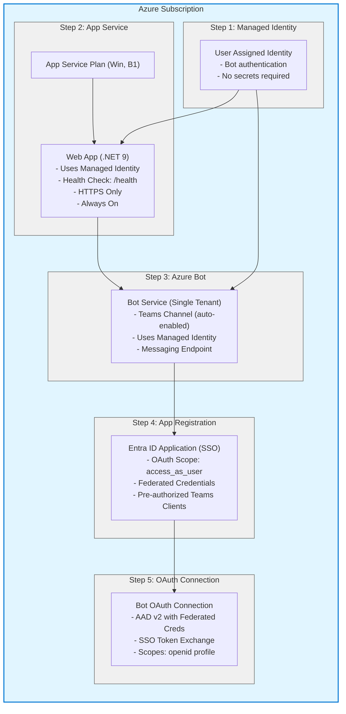

# Azure Production Deployment Guide

Complete guide for deploying your M365 Agent to Azure for production or development environments using Microsoft 365 Agents Toolkit.

---

## Table of Contents
- [Overview](#overview)
- [What Gets Deployed](#what-gets-deployed)
- [Architecture](#architecture)
- [Prerequisites](#prerequisites)
- [Quick Start](#quick-start)
- [Detailed Deployment Steps](#detailed-deployment-steps)
- [Configuration Reference](#configuration-reference)
- [Verification](#verification)
- [Troubleshooting](#troubleshooting)
- [Cost Estimates](#cost-estimates)

---

## Overview

This deployment creates a complete, production-ready Azure infrastructure for your M365 Agent with:
- **Managed Identity authentication** (no passwords or secrets)
- **Single Sign-On (SSO)** with federated credentials
- **Scalable Azure App Service** hosting
- **Azure Bot Service** with Teams channel
- **Infrastructure as Code** using Bicep

**Deployment Files:**
- `infra/azure.bicep` - Main infrastructure template
- `infra/azure.parameters.json` - Parameter configuration
- `m365agents.yml` - Microsoft 365 Agents Toolkit orchestration

---

## What Gets Deployed

When you run `atk provision --env dev`, the following Azure resources are created:

| Resource | Purpose | Naming Pattern |
|----------|---------|----------------|
| **User Assigned Managed Identity** | Bot identity (no passwords!) | `{resourceBaseName}-identity` |
| **App Service Plan** | Compute resources (Linux) | `{resourceBaseName}-plan` |
| **Web App** | Hosts .NET 9 bot application | `{resourceBaseName}-app` |
| **Azure Bot Service** | Azure Bot Service registration | `{resourceBaseName}` |
| **Entra ID App Registration** | SSO authentication | `{botDisplayName}` |
| **OAuth Connection** | SSO token exchange | `SsoConnection` |

**Example with `resourceBaseName=botprod123`:**
- Managed Identity: `botprod123-identity`
- App Service: `botprod123-app.azurewebsites.net`
- Bot Service: `botprod123`

---

## Architecture



---

## Prerequisites

### Required Tools

| Tool | Version | Installation |
|------|---------|--------------|
| **Azure CLI** | Latest | [Install Guide](https://learn.microsoft.com/cli/azure/install-azure-cli) |
| **Microsoft 365 Agents Toolkit CLI** | Latest | [Install Guide](https://aka.ms/m365agentstoolkit-cli) |
| **.NET SDK** | 9.0 | [Download](https://dotnet.microsoft.com/download/dotnet/9.0) |

**Installation Commands:**
```powershell
# Azure CLI
winget install Microsoft.AzureCLI

# Microsoft 365 Agents Toolkit CLI
npm install -g @microsoft/m365agentstoolkit-cli

# Verify installations
az --version
atk --version
dotnet --version
```

### Required Azure Permissions

| Permission | Scope | Purpose |
|------------|-------|---------|
| **Contributor** | Subscription or Resource Group | Deploy Azure resources |
| **Application Administrator** | Entra ID | Create app registrations |

**Verify permissions:**
```powershell
# Check Azure login and subscription
az login
az account show

# Check assigned roles
az role assignment list --assignee $(az account show --query user.name -o tsv)
```

---

## Quick Start

### Step 1: Configure Environment Variables

Edit `M365Agent/env/.env.dev`:

```bash
# ============================================================================
# Microsoft Foundry Configuration (REQUIRED - Set these before provisioning)
# ============================================================================
AZURE_AI_FOUNDRY_PROJECT_ENDPOINT=<URL of your MS Foundry endpoint>
AGENT_ID=<Agent ID that start by asst_>

```

### Step 2: Provision Azure Infrastructure

**Using Microsoft 365 Agents Toolkit UI (Recommended):**
1. Open the **Microsoft 365 Agents Toolkit** extension panel in VS Code or Visual Studio
2. Navigate to the **Lifecycle** section
3. Select environment: **dev**
4. Click **Provision** to create Azure resources

**What happens:**
1. ✅ Creates Teams app registration in Teams Developer Portal
2. ✅ Deploys Azure resources via `azure.bicep`
3. ✅ Creates Managed Identity → App Service → Bot → App Registration → OAuth Connection
4. ✅ Captures all outputs to `.env.dev`
5. ✅ Builds and validates Teams app package
6. ✅ Registers app with Teams Developer Portal

**Expected output:**
```
✓ Teams app created successfully
✓ Provisioning Azure resources...
✓ Managed Identity created: <AppName>-identity
✓ App Service deployed: https://<AppName>-app.azurewebsites.net
✓ Bot Service registered: <AppName>
✓ SSO App Registration created
✓ OAuth Connection configured
✓ Teams app package validated
✓ Provision completed successfully
```

**Duration:** ~5-8 minutes

**Alternatively, using CLI:**
```powershell
cd M365Agent
atk provision --env dev
```

### Step 3: Deploy Application Code

**Using Microsoft 365 Agents Toolkit UI (Recommended):**
1. In the **Microsoft 365 Agents Toolkit** extension panel
2. Navigate to the **Lifecycle** section
3. Select environment: **dev**
4. Click **Deploy** to publish application code

**What happens:**
1. ✅ Builds .NET application (`dotnet publish -c Release`)
2. ✅ Creates deployment package
3. ✅ Uploads to Azure App Service
4. ✅ Bot is now live at the messaging endpoint

**Expected output:**
```
✓ Building application...
✓ Publishing to Azure...
✓ Deployment completed successfully
✓ Bot endpoint: https://botprod123-app.azurewebsites.net/api/messages
```

**Duration:** ~2-3 minutes

**Alternatively, using CLI:**
```powershell
cd M365Agent
atk deploy --env dev
```

### Step 4: Install in Microsoft 365 Copilot & Microsoft Teams

**Note:** The app is automatically registered in Teams Developer Portal during provisioning. However, you can manually install it if needed:

1. Open **Microsoft Teams**
2. Go to **Apps** → **Manage your apps**
3. Click **Upload an app** → **Upload a custom app**
4. Select: `M365Agent/appPackage/build/appPackage.dev.zip`
5. Click **Add** to install your bot
6. Start chatting with your agent!

---

## Detailed Deployment Steps

### Step 1: Managed Identity Creation

**Module:** `modules/bot-managedidentity.bicep`

**Purpose:** Creates a user-assigned managed identity that serves as the bot's identity, eliminating the need for passwords or client secrets.

**Resources Created:**
```
Resource Type: Microsoft.ManagedIdentity/userAssignedIdentities
Name: {resourceBaseName}-identity
Location: Same as resource group
```

**Key Outputs:**
- `identityId`: Full resource ID
- `identityClientId`: Client ID (used as BOT_ID)
- `identityPrincipalId`: Principal ID for RBAC assignments

**Why It Matters:**
- ✅ No secrets to manage or rotate
- ✅ Secure authentication to Azure services
- ✅ Integrated Azure RBAC support
- ✅ Used as bot's identity in Azure Bot Service

---

### Step 2: App Service Deployment

**Module:** `modules/appservice.bicep`

**Purpose:** Creates the compute infrastructure to host your .NET 9 bot application.

**Resources Created:**

1. **App Service Plan**
   - OS: Windows
   - SKU: B1 (Basic) - configurable
   - Reserved: false

2. **Web App**
   - Runtime: .NET 9.0
   - Identity: User Assigned Managed Identity
   - HTTPS: Enforced
   - Always On: Enabled
   - Health Check: `/health` endpoint

**Configuration Applied:**
```json
{
  "ASPNETCORE_ENVIRONMENT": "Production",
  "WEBSITE_RUN_FROM_PACKAGE": "1",
  "AZURE_CLIENT_ID": "{managed-identity-client-id}",
  "MicrosoftAppType": "UserAssignedMSI",
  "MicrosoftAppId": "{managed-identity-client-id}",
  "MicrosoftAppTenantId": "{tenant-id}"
}
```

**Key Outputs:**
- `webAppName`: App Service name
- `webAppHostName`: Public hostname (e.g., `botprod123-app.azurewebsites.net`)
- `webAppResourceId`: Full resource ID for deployment target
- `webAppPrincipalId`: Principal ID for permissions

**Features:**
- ✅ Auto-scaling capable (upgrade SKU to enable)
- ✅ Deployment slots support
- ✅ Built-in monitoring with health checks
- ✅ CORS configured for Azure Portal

---

### Step 3: Bot Service Registration

**Module:** `modules/azurebot.bicep`

**Purpose:** Registers your web service as a bot with Azure Bot Service and enables Teams channel.

**Resources Created:**

1. **Bot Service**
   ```
   Kind: azurebot
   Location: global
   SKU: F0 (Free) or S1 (Standard)
   ```

2. **Teams Channel**
   - Automatically enabled
   - No additional configuration needed

**Configuration:**
```json
{
  "displayName": "{botDisplayName}",
  "endpoint": "https://{webAppHostName}/api/messages",
  "msaAppId": "{managed-identity-client-id}",
  "msaAppTenantId": "{tenant-id}",
  "msaAppType": "UserAssignedMSI",
  "msaAppMSIResourceId": "{managed-identity-resource-id}"
}
```

**Key Outputs:**
- `botServiceName`: Name of the bot service
- `botEndpoint`: Messaging endpoint URL

**Features:**
- ✅ Integrated with Managed Identity
- ✅ Teams channel pre-configured
- ✅ Additional channels available (Slack, Web Chat, etc.)
- ✅ No passwords or secrets required

---

### Step 4: App Registration for SSO

**Module:** `modules/app-registration.bicep`

**Purpose:** Creates an Entra ID application for Single Sign-On (SSO) authentication with federated credentials.

**Resources Created:**

1. **Application Registration**
   ```
   Display Name: {botDisplayName}
   Sign-in Audience: AzureADMyOrg (Single Tenant)
   ```

2. **OAuth2 Permission Scope**
   ```
   Scope: access_as_user
   Display Name: Access as the user
   Type: User
   ```

3. **Federated Identity Credential**
   ```
   Subject: /eid1/c/pub/t/{encodedTenantId}/a/{encodedAppId}/{uniqueId}
   Issuer: https://token.botframework.com/
   Audience: api://botframework.com
   ```

4. **Pre-authorized Client Applications**
   - Microsoft Teams (Desktop/Mobile)
   - Microsoft Teams (Web)
   - Microsoft 365 Web Client
   - Microsoft 365 Desktop Client

**Key Outputs:**
- `aadAppId`: Application (client) ID
- `aadAppObjectId`: Object ID
- `aadAppIdUri`: Application ID URI (e.g., `api://botprod123-app.azurewebsites.net/{guid}`)
- `servicePrincipalId`: Service Principal ID

**Features:**
- ✅ Federated credentials (no client secrets)
- ✅ Pre-configured for Teams SSO
- ✅ Proper OAuth scopes
- ✅ Secure token exchange

**Note:** The module uses `guid-encoder.bicep` to properly encode GUIDs for federated credentials.

---

### Step 5: OAuth Connection

**Module:** `modules/bot-oauth-connection.bicep`

**Purpose:** Configures the OAuth connection between the bot and the SSO app registration.

**Resources Created:**
```
Resource: Microsoft.BotService/botServices/connections
Connection Name: SsoConnection
Service Provider: Azure Active Directory v2
```

**Configuration:**
```json
{
  "clientId": "{sso-app-id}",
  "tokenExchangeUrl": "{app-id-uri}",
  "scopes": "openid profile offline_access",
  "tenantId": "{tenant-id}"
}
```

**Key Outputs:**
- `oauthConnectionName`: Connection name (`SsoConnection`)

**Features:**
- ✅ Azure AD v2 authentication
- ✅ Uses federated credentials
- ✅ Token exchange for SSO
- ✅ Refresh token support

---

## Configuration Reference

### Environment Variables (.env.dev)

#### User-Provided Variables
```bash
# Azure subscription and resource group
AZURE_SUBSCRIPTION_ID=<guid>
AZURE_RESOURCE_GROUP_NAME=rg-m365agent-prod

# Resource naming
RESOURCE_SUFFIX=prod123        # Must be globally unique
APP_NAME_SUFFIX=dev           # Appended to display name

# Environment
TEAMSFX_ENV=dev
```

#### Auto-Populated Variables
These are automatically set during `atk provision`:

```bash
# Teams App
TEAMS_APP_ID=<guid>
TEAMS_APP_TENANT_ID=<guid>

# Bot Identity (Managed Identity)
BOT_ID=<guid>
identityId=/subscriptions/.../Microsoft.ManagedIdentity/userAssignedIdentities/...
identityPrincipalId=<guid>

# App Service
BOT_AZURE_APP_SERVICE_RESOURCE_ID=/subscriptions/.../Microsoft.Web/sites/...
webAppName=botprod123-app
webAppHostName=botprod123-app.azurewebsites.net
webAppUrl=https://botprod123-app.azurewebsites.net

# Bot Service
botEndpoint=https://botprod123-app.azurewebsites.net/api/messages

# App Registration (SSO)
AAD_APP_CLIENT_ID=<guid>
AAD_APP_OBJECT_ID=<guid>
AAD_APP_ID_URI=api://botprod123-app.azurewebsites.net/<guid>
servicePrincipalId=<guid>

# OAuth Connection
oauthConnectionName=SsoConnection
```

### Bicep Parameters (azure.parameters.json)

```json
{
  "$schema": "https://schema.management.azure.com/schemas/2019-04-01/deploymentParameters.json#",
  "contentVersion": "1.0.0.0",
  "parameters": {
    "resourceBaseName": {
      "value": "bot${{RESOURCE_SUFFIX}}"
    },
    "botDisplayName": {
      "value": "AzureAgentToM365ATK${{APP_NAME_SUFFIX}}"
    },
    "webAppSKU": {
      "value": "B1"
    },
    "botServiceSku": {
      "value": "F0"
    },
    "enableAppInsights": {
      "value": false
    }
  }
}
```

**Parameter Descriptions:**

| Parameter | Default | Description | Options |
|-----------|---------|-------------|---------|
| `resourceBaseName` | `bot{suffix}` | Base name for all resources | Lowercase, alphanumeric |
| `botDisplayName` | `AzureAgentToM365ATK{suffix}` | Display name in Teams | Any string |
| `webAppSKU` | `B1` | App Service Plan tier | F1, B1, S1, P1v2, P2v2 |
| `botServiceSku` | `F0` | Bot Service tier | F0 (free), S1 (standard) |
| `enableAppInsights` | `false` | Enable Application Insights | true/false |

### Teams App Manifest

The manifest is auto-generated with SSO configuration:

```json
{
  "$schema": "https://developer.microsoft.com/json-schemas/teams/vDevPreview/MicrosoftTeams.schema.json",
  "manifestVersion": "devPreview",
  "id": "${{TEAMS_APP_ID}}",
  "version": "1.0.0",
  "developer": {
    "name": "Your Company",
    "websiteUrl": "https://www.example.com",
    "privacyUrl": "https://www.example.com/privacy",
    "termsOfUseUrl": "https://www.example.com/terms"
  },
  "name": {
    "short": "Azure Agent",
    "full": "Azure Agent for M365"
  },
  "description": {
    "short": "AI agent for Azure operations",
    "full": "An intelligent agent that helps with Azure operations and tasks"
  },
  "bots": [
    {
      "botId": "${{BOT_ID}}",
      "scopes": ["personal", "team", "groupchat"],
      "supportsFiles": false,
      "isNotificationOnly": false
    }
  ],
  "webApplicationInfo": {
    "id": "${{AAD_APP_CLIENT_ID}}",
    "resource": "${{AAD_APP_ID_URI}}"
  },
  "validDomains": [
    "${{webAppHostName}}"
  ]
}
```

---

## Verification

### 1. Verify Azure Resources

```powershell
# List all resources in the resource group
az resource list --resource-group rg-m365agent-prod --output table

# Check Web App status
az webapp show --name botprod123-app --resource-group rg-m365agent-prod --query state

# Check Bot Service
az bot show --name botprod123 --resource-group rg-m365agent-prod

# Test Web App endpoint
curl https://botprod123-app.azurewebsites.net/health
```

### 2. Verify Teams App

1. Open **Microsoft Teams**
2. Go to **Apps** → **Built for your org**
3. Find your app and click it
4. Click **Add** if not already installed
5. Send a message to the bot
6. Verify you get a response

### 3. Verify SSO

1. In Teams, send a message that requires authentication
2. You should see a sign-in card
3. Click **Sign In**
4. If SSO is working, you'll be signed in automatically (no additional prompts)
5. Bot should receive your authentication token

### 4. Check Logs

```powershell
# Stream Web App logs
az webapp log tail --name botprod123-app --resource-group rg-m365agent-prod

# View recent log entries
az webapp log download --name botprod123-app --resource-group rg-m365agent-prod --log-file logs.zip
```

---

## Troubleshooting

### Provision Failed: "Subscription not found"

**Problem:** Azure subscription ID is incorrect or you don't have access.

**Solution:**
```powershell
# List available subscriptions
az account list --output table

# Set the correct subscription
az account set --subscription <subscription-id>

# Update .env.dev with correct AZURE_SUBSCRIPTION_ID
```

---

### Provision Failed: "Resource name already exists"

**Problem:** The `RESOURCE_SUFFIX` is not unique globally.

**Solution:**
1. Choose a different suffix in `.env.dev`
2. Update `RESOURCE_SUFFIX=prod456` (use random characters)
3. Run `atk provision --env dev` again

---

### Deploy Failed: "Could not find resource"

**Problem:** Provision step didn't complete successfully.

**Solution:**
1. Check if resources exist: `az resource list --resource-group <rg-name>`
2. If missing, run: `atk provision --env dev`
3. Then retry: `atk deploy --env dev`

---

### Bot Not Responding in Teams

**Checklist:**
1. ✅ Verify Web App is running:
   ```powershell
   az webapp show --name botprod123-app --resource-group rg-m365agent-prod --query state
   ```

2. ✅ Test health endpoint:
   ```powershell
   curl https://botprod123-app.azurewebsites.net/health
   ```

3. ✅ Check bot endpoint in Azure Portal:
   - Go to Bot Service → Configuration
   - Verify messaging endpoint matches Web App URL + `/api/messages`

4. ✅ Check application logs:
   ```powershell
   az webapp log tail --name botprod123-app --resource-group rg-m365agent-prod
   ```

---

### SSO Not Working

**Checklist:**
1. ✅ Verify `webApplicationInfo` in manifest:
   - Open `appPackage/build/manifest.dev.json`
   - Check `id` matches `AAD_APP_CLIENT_ID`
   - Check `resource` matches `AAD_APP_ID_URI`

2. ✅ Verify OAuth connection:
   ```powershell
   az bot authsetting show --name botprod123 --resource-group rg-m365agent-prod --setting-name SsoConnection
   ```

3. ✅ Check federated credentials:
   - Go to Azure Portal → Entra ID → App Registrations
   - Find your SSO app
   - Check **Certificates & secrets** → **Federated credentials**
   - Should see credential with issuer `https://token.botframework.com/`

4. ✅ Verify pre-authorized clients:
   - In App Registration → **Expose an API**
   - Check **Authorized client applications**
   - Should see Teams client IDs

---

### Permission Denied Errors

**Problem:** Insufficient permissions to create resources.

**Required Roles:**
- **Azure:** Contributor on subscription or resource group
- **Entra ID:** Application Administrator or Cloud Application Administrator

**Solution:**
```powershell
# Check current role assignments
az role assignment list --assignee $(az account show --query user.name -o tsv)

# Request required permissions from your Azure administrator
```

---

### GUID Encoder Warnings

**Warning Message:**
```
WARNING: guidEncoderApiEndpoint parameter is used but not defined in deployment
```

**Explanation:** This warning is expected. The GUID encoder uses Azure deployment scripts internally and doesn't require an external API endpoint.

**Action:** This is safe to ignore. The deployment will complete successfully.

---

## Cost Estimates

Monthly cost estimates for Azure resources (USD, as of 2025):

### Basic Development (B1 + Free Bot)
| Resource | SKU | Cost/Month |
|----------|-----|------------|
| App Service Plan | B1 (Windows) | ~$55 |
| Bot Service | F0 (Free) | $0 |
| Managed Identity | - | $0 |
| App Registration | - | $0 |
| **Total** | | **~$55/month** |

### Standard Production (S1 + Standard Bot)
| Resource | SKU | Cost/Month |
|----------|-----|------------|
| App Service Plan | S1 (Windows) | ~$70 |
| Bot Service | S1 (Standard) | ~$0.50 per 1,000 messages |
| Managed Identity | - | $0 |
| App Registration | - | $0 |
| **Total** | | **~$70-100/month** |

### Premium Production (P1v2 + Standard Bot)
| Resource | SKU | Cost/Month |
|----------|-----|------------|
| App Service Plan | P1v2 (Windows) | ~$146 |
| Bot Service | S1 (Standard) | ~$0.50 per 1,000 messages |
| Application Insights | Standard | ~$2-10 (if enabled) |
| **Total** | | **~$150-200/month** |

**Notes:**
- Costs vary by Azure region
- Bot Service F0 tier limited to 10,000 messages/month
- App Service includes 99.95% SLA
- Additional costs may apply for data transfer and storage

**Cost Optimization Tips:**
- Start with B1 tier for development
- Use F0 bot tier for low-traffic scenarios
- Scale up to S1/P1v2 only when needed
- Enable auto-shutdown for dev environments
- Use Azure Cost Management for monitoring

---

## Advanced Topics

### Scaling Your Deployment

**Horizontal Scaling (Multiple Instances):**
```powershell
# Scale out to 3 instances
az appservice plan update --name botprod123-plan --resource-group rg-m365agent-prod --number-of-workers 3
```

**Vertical Scaling (Larger SKU):**
```powershell
# Upgrade to S1 tier
az appservice plan update --name botprod123-plan --resource-group rg-m365agent-prod --sku S1
```

### Enabling Application Insights

Edit `azure.parameters.json`:
```json
{
  "enableAppInsights": {
    "value": true
  }
}
```

Re-run provision:
```powershell
atk provision --env dev
```

### Multiple Environments

Create separate environments for dev, staging, and production:

```powershell
# Development
cp env/.env.dev env/.env.dev
# Edit with dev settings

# Staging
cp env/.env.dev env/.env.staging
# Edit with staging settings

# Production
cp env/.env.dev env/.env.prod
# Edit with production settings

# Deploy to each environment
atk provision --env dev
atk provision --env staging
atk provision --env prod
```

### Continuous Deployment

Set up GitHub Actions or Azure DevOps pipeline:

```yaml
# Example GitHub Actions workflow
name: Deploy to Azure

on:
  push:
    branches: [main]

jobs:
  deploy:
    runs-on: ubuntu-latest
    steps:
      - uses: actions/checkout@v2
      
      - name: Setup .NET
        uses: actions/setup-dotnet@v1
        with:
          dotnet-version: '9.0.x'
      
      - name: Deploy
        run: |
          npm install -g @microsoft/m365agentstoolkit-cli
          atk deploy --env prod
        env:
          AZURE_CREDENTIALS: ${{ secrets.AZURE_CREDENTIALS }}
```

---

## Summary

You've successfully deployed your M365 Agent to Azure! 🎉

**Next Steps:**
1. ✅ Test your bot in Teams
2. ✅ Configure SSO and test authentication
3. ✅ Set up monitoring and alerts
4. ✅ Plan for scaling and high availability
5. ✅ Implement CI/CD for automated deployments

**Resources:**
- [Microsoft 365 Agents Toolkit Documentation](https://aka.ms/teams-toolkit-docs)
- [Azure Bot Service Documentation](https://learn.microsoft.com/azure/bot-service/)
- [Bicep Documentation](https://learn.microsoft.com/azure/azure-resource-manager/bicep/)
- [Microsoft 365 Agents SDK](https://github.com/microsoft/agents)

**Support:**
- GitHub Issues: [Microsoft 365 Agent Toolkit Repository](https://github.com/OfficeDev/TeamsFx/issues)
- Microsoft Q&A: [Teams Development](https://learn.microsoft.com/answers/topics/microsoft-teams.html)
