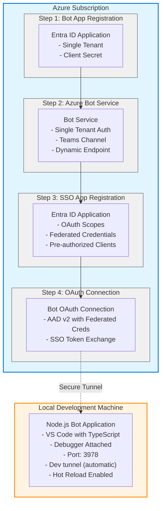

# Local Development & Debugging Guide

**Quick Start:** Press **F5** in Visual Studio Code to automatically provision, deploy, and debug your M365 Agent locally!

---

## Table of Contents
- [Overview](#overview)
- [IDE Support](#ide-support)
- [Prerequisites](#prerequisites)
- [Getting Started](#getting-started)
- [What Happens When You Press F5](#what-happens-when-you-press-f5)
- [Behind the Scenes](#behind-the-scenes)
- [Development Workflow](#development-workflow)
- [Troubleshooting](#troubleshooting)
- [Advanced Configuration](#advanced-configuration)

---

## Overview

Local development is **fully automated** through Microsoft 365 Agents Toolkit. Simply press **F5** and everything is handled for you:

**Automatic Process:**
- ✅ Environment files created/updated automatically
- ✅ Dev tunnel provisioned and started automatically
- ✅ Azure resources provisioned automatically (first run only)
- ✅ Bot application started with debugger attached
- ✅ Teams/M365 Copilot opens with agent automatically sideloaded
- ✅ Ready to debug with breakpoints immediately

**Key Features:**
- 🚀 **One-Click Start:** Press F5 and you're debugging
- ⚡ **Fast Iteration:** No manual deployment steps
- 🐛 **Full Debugging:** Breakpoints, watches, call stacks
- 🔄 **Auto-Sideload:** Agent appears directly in Teams/Copilot
- 🌐 **Secure Tunnel:** Dev tunnel automatically managed
- 💰 **Minimal Cost:** Only Bot Service (Free tier available)

**Configuration Files (Automated):**
- `.vscode/tasks.json` - Task orchestration (pre-configured)
- `m365agents.local.yml` - Microsoft 365 Agents Toolkit automation
- `infra/azure-local.bicep` - Infrastructure template
- `scripts/env.js` - Environment file management
- `scripts/devtunnel.ps1` - Dev tunnel automation
- `scripts/devtunnel.sh` - Dev tunnel automation (Linux/Mac)

---

## IDE Support

### Visual Studio Code (Recommended)
- **Full automation** - Press F5 and everything happens automatically
- **Dynamic dev tunnel** - Automatically created and managed
- **Pre-configured tasks** - Complete workflow automation
- **Zero manual steps** - Start debugging immediately
- **Hot reload** - TypeScript changes compile automatically

**This guide covers VS Code development.**

---

## Key Differences from Production

| Feature | Production Deployment | Local Development |
|---------|----------------------|-------------------|
| **Bot Hosting** | Azure App Service (Linux) | Local machine (VS Code) |
| **Bot Runtime** | Node.js 22 LTS | Node.js 22 |
| **Bot Identity** | User Assigned Managed Identity | App Registration with Client Secret |
| **Bot Auth** | UserAssignedMSI | SingleTenant + Client Secret |
| **Endpoint** | Static Azure URL | Dynamic devtunnel URL (auto-managed) |
| **SSO App** | Federated Credentials | Federated Credentials |
| **Cost** | ~$55-200/month | Bot Service only (~$0 with F0) |
| **Debugging** | Remote (limited) | Full local debugging with breakpoints |
| **Deployment** | `atk deploy` required | Run locally (F5) |
| **Iteration Speed** | 3-5 minutes | Instant (hot reload) |

---

## Architecture



---

## Prerequisites

### Required Tools

All tools are automatically detected and validated when you press F5. Install these first:

| Tool | Version | Purpose | Installation |
|------|---------|---------|--------------|
| **Visual Studio Code** | Latest | IDE | [Download](https://code.visualstudio.com/) |
| **Node.js** | 22 or 24 | Bot runtime & scripts | [Download](https://nodejs.org/) |
| **Azure CLI** | Latest | Azure authentication | `winget install Microsoft.AzureCLI` |
| **Dev Tunnels CLI** | Latest | Local endpoint exposure | `winget install Microsoft.devtunnel` |

**Quick Install (Windows):**
```powershell
# Install all at once
winget install Microsoft.VisualStudioCode
winget install OpenJS.NodeJS.LTS
winget install Microsoft.AzureCLI
winget install Microsoft.devtunnel

# Verify installations
node --version
npm --version
az --version
devtunnel --version
```

### Required IDE Extensions

**For VS Code (automatically recommended when you open the project):**
- **Microsoft 365 Agents Toolkit** - Handles all automation
- **Azure Account** - Azure authentication
- **TypeScript and JavaScript Language Features** - Built-in TypeScript support

**For Visual Studio Code:**
- **Microsoft 365 Agents Toolkit** - Available in Visual Studio Code as an Extension

### Required Azure Permissions

| Permission | Scope | Purpose |
|------------|-------|---------|
| **Contributor** | Subscription or Resource Group | Deploy Bot Service |
| **Application Administrator** | Entra ID | Create app registrations |

### Required Configuration

**Configuration needed** in `env/.env.local`:

```bash
# Your Azure subscription ID
AZURE_SUBSCRIPTION_ID=<your-subscription-id>

# Resource group name (can be new or existing)
AZURE_RESOURCE_GROUP_NAME=rg-m365agent-local

# Microsoft Foundry Configuration
AZURE_AI_FOUNDRY_PROJECT_ENDPOINT=<your-ai-foundry-endpoint>
AGENT_ID=<your-agent-id-starting-with-asst_>
```

**Find your subscription ID:**
```powershell
az login
az account show --query id -o tsv
```

**Everything else is automated!** 🎉

---

## Getting Started

### First Time Setup - VS Code (2 Steps)

1. **Configure Azure credentials** in `env/.env.local`:
   ```bash
   # Azure Configuration
   AZURE_SUBSCRIPTION_ID=<your-subscription-id>
   AZURE_RESOURCE_GROUP_NAME=rg-azureagent-local
   
   # Microsoft Foundry Configuration
   AZURE_AI_FOUNDRY_PROJECT_ENDPOINT=<your-ai-foundry-endpoint>
   AGENT_ID=<your-agent-id>
   ```

2. **Press F5** in VS Code

That's it! Everything else happens automatically.

### What You'll See

1. **Terminal opens** - Running automated tasks
2. **Environment files checked** - `.env.local` validated
3. **npm install** - Installing dependencies (first time only)
4. **TypeScript compilation** - Building to `dist/` folder
5. **Dev tunnel started** - Secure HTTPS endpoint created
6. **Azure login prompt** - Authenticate once (if not already logged in)
7. **Provisioning progress** - Creating Azure resources (first time only, ~2-3 minutes)
8. **Bot starts** - Node.js application running on port 3978 with debugger attached
9. **Browser opens** - Teams/M365 Copilot chat with your agent already sideloaded

**You're now debugging!** Set breakpoints and start chatting with your agent.

---

## What Happens When You Press F5

Microsoft 365 Agents Toolkit orchestrates the entire process automatically:

### Step 1: Ensure Environment Files (Automatic)
**Task:** `Ensure env files`  
**Script:** `scripts/env.js`

```
✓ Checking env/.env.local
✓ Adding missing variables with defaults
✓ SSOAPPID set to 00000000-0000-0000-0000-000000000000
✓ AZURE_AI_FOUNDRY_PROJECT_ENDPOINT validated
✓ AGENT_ID validated
```

**What it does:**
- Creates `.env.local` if it doesn't exist
- Adds any missing required variables
- Preserves existing values
- Sets smart defaults (e.g., zero GUID for first-time SSOAPPID)

### Step 2: Ensure Dev Tunnel (Automatic)
**Task:** `Ensure DevTunnel`  
**Script:** `scripts/devtunnel.ps1` (Windows) or `devtunnel.sh` (Mac/Linux)

```
✓ Checking for existing tunnel...
✓ Creating new tunnel: gentle-rain-abc123
✓ Starting tunnel on port 3978
✓ Tunnel URL: https://gentle-rain-abc123-3978.euw.devtunnels.ms
✓ Updating .env.local with tunnel info
✓ BOT_ENDPOINT set to https://gentle-rain-abc123-3978.euw.devtunnels.ms/api/messages
✓ BOT_DOMAIN set to gentle-rain-abc123-3978.euw.devtunnels.ms
✓ TUNNEL_ID set to gentle-rain-abc123
```

**What it does:**
- Checks if dev tunnel already exists (reads `TUNNEL_ID` from `.env.local`)
- Creates new tunnel if needed (`devtunnel create`)
- Starts tunnel on port 3978
- Writes tunnel URL back to `.env.local`
- Keeps tunnel running in background

### Step 3: Validate Prerequisites (Automatic)
**Task:** `Validate prerequisites`  
**Type:** `teamsfx` (Microsoft 365 Agents Toolkit)

```
✓ Node.js version: 18.x or higher
✓ M365 account: Signed in as user@contoso.com
✓ Port 3978: Available
```

**What it checks:**
- Node.js is installed and correct version
- You're signed into a Microsoft 365 account
- Required port (3978) is not in use

### Step 4: Provision Azure Resources (Automatic - First Time Only)
**Task:** `Provision`  
**Type:** `teamsfx` (Executes `atk provision --env local`)
**Configuration:** `m365agents.local.yml`

```
✓ Creating Teams app registration...
✓ Creating Bot App Registration (Entra ID)...
  - Name: AzureAgentToM365ATKlocal
  - Client Secret: Generated
  - Single Tenant
✓ Deploying Azure infrastructure (Bicep)...
  - Creating Service Principal for Bot App
  - Creating SSO App Registration (first time only)
    - Name: AzureAgentToM365ATK-UserAuth-local
    - Federated Credentials configured
    - OAuth scopes: access_as_user
  - Creating Azure Bot Service
    - SKU: F0 (Free)
    - Endpoint: Your dev tunnel URL
  - Creating OAuth Connection
    - Name: SsoConnection
    - Provider: Azure AD v2
    - Federated credentials enabled
✓ Writing outputs to .env.local...
  - SSOAPPID updated with actual GUID
  - OAUTHCONNECTIONNAME set to SsoConnection
```

**What it creates (first time):**
1. **Teams App** - Registered in your M365 tenant
2. **Bot App Registration** - Entra ID app with client secret
3. **SSO App Registration** - Entra ID app with federated credentials
4. **Azure Bot Service** - F0 (Free) tier
5. **OAuth Connection** - Connects bot to SSO app
6. **Environment variables** - All IDs and endpoints saved

**Subsequent runs:**
- Skips SSO app creation (already exists)
- Updates bot endpoint only (if tunnel URL changed)
- Takes ~30 seconds instead of 2-3 minutes

### Step 5: Deploy (Automatic)
**Task:** `Deploy`  
**Type:** `teamsfx` (Executes `atk deploy --env local`)

```
✓ Building Teams app package...
✓ Updating app manifest with current values...
✓ Packaging app for sideloading...
```

**What it does:**
- Builds the Teams app package (`.zip`)
- Updates manifest with current BOT_ID, SSOAPPID, etc.
- Prepares for automatic sideloading

### Step 6: Start Application (Automatic)
**Task:** `Start application`  
**Command:** `npm run dev:teamsfx` (runs nodemon with ts-node)

```
✓ Installing dependencies (first time)...
✓ Compiling TypeScript...
✓ Starting bot application on http://localhost:3978
✓ Bot endpoint: /api/messages
✓ Health check: /health
✓ Debugger attached
✓ Hot reload enabled
✓ Ready to receive messages!
```

**What it does:**
- Runs `npm install` (first time or when package.json changes)
- Compiles TypeScript to JavaScript
- Starts the bot on port 3978 using nodemon
- Attaches VS Code debugger
- Enables hot reload for TypeScript changes
- Bot listens for messages from Teams/Copilot via dev tunnel

### Step 7: Launch Browser (Automatic)
**Launch Configuration:** `.vscode/launch.json`

```
✓ Opening Microsoft Edge...
✓ Navigating to Teams/Copilot...
✓ Automatically sideloading agent...
✓ Agent ready to chat!
```

**What it does:**
- Opens your default browser (or specified browser)
- Navigates directly to Teams or M365 Copilot
- Automatically sideloads your agent (no manual installation!)
- Agent appears in chat immediately

---

## Behind the Scenes

### Two-App Security Architecture

The automated deployment creates **two separate app registrations** for security best practices:

#### App 1: Bot App Registration
**Created by:** Microsoft 365 Agents Toolkit  
**Name:** `AzureAgentToM365ATKlocal`  
**Purpose:** Bot Service authentication  
**Authentication:** Client ID + Client Secret

**Used for:**
- Azure Bot Service authentication
- Bot Service communication
- Local development identity (replaces Managed Identity)

**Configuration:**
```yaml
Sign-in Audience: AzureADMyOrg (Single tenant)
Client Secret: Generated during provision
Required for: Bot Service to verify bot identity
```

#### App 2: SSO App Registration
**Created by:** Bicep template (automatic)  
**Name:** `AzureAgentToM365ATK-UserAuth-local`  
**Purpose:** User authentication and SSO  
**Authentication:** Federated Credentials (no secrets!)

**Used for:**
- Single Sign-On (SSO) with users
- Token exchange for user authentication
- Accessing user resources on behalf of user

**Configuration:**

**OAuth 2.0 Scopes:**

| Scope | Type | Purpose | Consent Required |
|-------|------|---------|------------------|
| `access_as_user` | User | Default scope for Agent SSO access | User consent |

**Pre-Authorized Applications:**

Applications that can access the `access_as_user` scope without requiring user consent:

| Application | App ID | Purpose |
|-------------|--------|---------|
| Teams web client | `1fec8e78-bce4-4aaf-ab1b-5451cc387264` | Teams in browser |
| Teams desktop client | `5e3ce6c0-2b1f-4285-8d4b-75ee78787346` | Teams desktop app |
| Microsoft 365 web application | `4765445b-32c6-49b0-83e6-1d93765276ca` | Office.com portal |
| Microsoft 365 desktop application | `0ec893e0-5785-4de6-99da-4ed124e5296c` | Office desktop apps |
| Microsoft 365 mobile/Outlook desktop | `d3590ed6-52b3-4102-aeff-aad2292ab01c` | M365 mobile & Outlook desktop |
| Outlook web application | `bc59ab01-8403-45c6-8796-ac3ef710b3e3` | Outlook in browser |
| Outlook mobile application | `27922004-5251-4030-b22d-91ecd9a37ea4` | Outlook mobile app |

**Required API Permissions:**

| API | Permission | Type | Purpose |
|-----|------------|------|---------|
| Microsoft Graph | `openid` | Delegated | OpenID Connect sign-in |
| Microsoft Graph | `profile` | Delegated | User profile information |
| Microsoft Graph | `email` | Delegated | User email address |
| Microsoft Graph | `offline_access` | Delegated | Refresh token for long-lived sessions |
| Azure Machine Learning | `user_impersonation` | Delegated | Required for Azure AI Foundry Agent SSO |

**Federated Identity Credential:**

| Property | Value |
|----------|-------|
| Audience | `api://AzureADTokenExchange` |
| Issuer | `https://login.microsoftonline.com/{tenantId}/v2.0` |
| Subject | `/eid1/c/pub/t/{encodedTenantId}/a/9ExAW52n_ky4ZiS_jhpJIQ/{guid}` |
| Description | Federated credential for Bot Framework token exchange |

**App ID URI:**
```
api://botid-{BOT_ID}
```

**Redirect URIs:**
```
https://token.botframework.com/.auth/web/redirect
```

**Why Two Apps?**
- **Security separation:** Bot auth ≠ User auth
- **Different lifecycles:** Bot secret rotation vs federated creds
- **Best practice:** Principle of least privilege

### Conditional Deployment Intelligence

The Bicep template automatically detects first-time vs. update scenarios:

#### First Run: Full Provisioning
**When:** `SSOAPPID = 00000000-0000-0000-0000-000000000000` in `.env.local`

```
⏱️ Duration: 2-3 minutes

✓ Create Service Principal for Bot App
✓ Create SSO App Registration
  - Configure OAuth scopes
  - Add federated credentials
  - Pre-authorize Teams clients
✓ Create Azure Bot Service
  - Configure bot endpoint (dev tunnel URL)
  - Enable Teams channel
✓ Create OAuth Connection
  - Link bot to SSO app
  - Configure token exchange
✓ Write SSOAPPID back to .env.local
```

**After first run, `.env.local` contains the real SSO App GUID.**

#### Subsequent Runs: Update Only
**When:** `SSOAPPID` contains a real GUID (from previous run)

```
⏱️ Duration: 30 seconds

✓ Update Bot Service endpoint only
  - New dev tunnel URL (if changed)
⏭️ Skip SSO App Registration (already exists)
⏭️ Skip OAuth Connection (already exists)
```

**Why this matters:**
- **Fast iterations:** Change tunnel URL without recreating SSO app
- **Preserve credentials:** SSO app and federated credentials stay intact
- **Consistent IDs:** Same SSO App GUID across debug sessions

### Infrastructure Modules

All automated through Bicep templates:

**`infra/azure-local.bicep`** - Main orchestrator
- Detects first-time vs. update based on SSOAPPID
- Coordinates all module deployments
- Outputs values back to `.env.local`

**`infra/modules/service-principal.bicep`**
- Creates service principal for Bot App
- Required for bot to authenticate with Bot Service

**`infra/modules/app-registration.bicep`**
- Creates SSO App Registration
- Configures federated credentials
- Sets up OAuth scopes and pre-authorized clients

**`infra/modules/bot-oauth-connection.bicep`**
- Creates OAuth connection in Bot Service
- Links bot to SSO app for token exchange
- Enables SSO flow

---

## Development Workflow

### Daily Development (Fully Automated)

**Every debug session:**
1. Press **F5** in VS Code
2. Everything happens automatically (see [What Happens When You Press F5](#what-happens-when-you-press-f5))
3. Browser opens with agent ready to chat
4. Start debugging!

That's the entire workflow! 🎉

### Making Code Changes

**Iterative development:**
1. **Make changes** to your TypeScript code
2. **Save files** (Ctrl+S)
3. **Stop debugging** (Shift+F5) or use nodemon hot reload
4. **Press F5** again
5. **Test immediately** in Teams/Copilot

**Hot reload (automatic with nodemon):**
- Edit code while debugging
- Save file
- Nodemon detects changes and automatically restarts
- No need to manually restart debugger

### Testing Different Scenarios

**Set breakpoints anywhere:**
```typescript
// In src/agent.ts or src/index.ts
app.activity(ActivityTypes.Message, async (context: TurnContext) => {
    // Set breakpoint here
    const text = context.activity.text;
    
    // Execution pauses when user sends message
    // Inspect variables, step through code
});
```

**Debug flow:**
1. Set breakpoints in VS Code
2. Send message from Teams/Copilot
3. VS Code pauses at breakpoint
4. Inspect variables, call stack, watches
5. Continue execution (F5) or step through (F10/F11)

### Testing SSO Flow (Automatic)

SSO is **automatically configured** during F5 provisioning. Test it by triggering authentication in your bot:

```typescript
// Your bot code - request user token
const tokenResponse = await context.adapter.getUserToken(
    context,
    "SsoConnection", // Automatically configured
    undefined
);

if (tokenResponse) {
    // User authenticated! Token available
    const accessToken = tokenResponse.token;
} else {
    // Send OAuth card (automatic)
    // User will see "Sign in" button
}
```

**Expected flow (automatic):**
1. User sends message requiring auth
2. Bot requests token via OAuth connection
3. If not authenticated: OAuth card appears
4. User clicks "Sign In"
5. SSO happens silently (federated credentials!)
6. Bot receives token

**Everything is pre-configured:**
- ✅ OAuth connection name: `SsoConnection`
- ✅ Federated credentials: Configured in SSO app
- ✅ Pre-authorized clients: Teams/Outlook/M365
- ✅ Manifest `webApplicationInfo`: Automatically updated

### Multi-Developer Setup (Still Automated!)

**Each developer:**
1. Clones the repo
2. Creates their own `.env.local` with their Azure subscription
3. Presses F5

**What happens:**
- Each developer gets their own dev tunnel
- Each developer's bot endpoint is registered in Bot Service
- SSO app and OAuth connection are **shared** (created once by first developer)
- No conflicts!

**Shared resources:**
- ✅ Azure Bot Service registration
- ✅ SSO App Registration
- ✅ Teams App registration

**Per-developer:**
- ✅ Dev tunnel URL (unique)
- ✅ Bot endpoint (points to their tunnel)
- ✅ Local debugger session

---

## Troubleshooting

Most issues are **automatically resolved** when you press F5 again. If you encounter problems:

### F5 Doesn't Start

**Solution:** Check the **Terminal** panel in VS Code for error messages.

**Common issues:**

1. **"Node.js not found"**
   ```powershell
   # Install Node.js
   winget install OpenJS.NodeJS.LTS
   ```

2. **"devtunnel not found"**
   ```powershell
   # Install Dev Tunnels CLI
   winget install Microsoft.devtunnel
   ```

3. **"Port 5130 already in use"**
   ```powershell
   # Find and kill the process
   netstat -ano | findstr :5130
   taskkill /PID <process-id> /F
   ```

Then press **F5** again - everything will retry automatically.

---

### Bot Not Responding in Teams/Copilot

**Automatic checks performed:**
- ✅ Dev tunnel is running (automatic)
- ✅ Bot application is running (automatic)
- ✅ Bot endpoint is configured (automatic)

**If still not working:**

1. **Stop debugging** (Shift+F5)
2. **Press F5 again** - full re-provisioning happens
3. **Check terminal output** for any errors

**Manual verification (advanced):**
```powershell
# Check if bot is accessible via tunnel
curl <BOT_ENDPOINT_from_.env.local>

# Should return Azure Bot Service response
```

---

### Provisioning Errors

**Error: "Insufficient permissions"**

**Cause:** Missing Azure permissions

**Solution:**
- Need **Contributor** role on subscription/resource group
- Need **Application Administrator** role in Entra ID
- Contact your Azure/M365 admin

**Error: "SSOAPPID is invalid"**

**Cause:** `.env.local` has incorrect SSOAPPID value

**Solution:**
1. Open `env/.env.local`
2. Set `SSOAPPID=00000000-0000-0000-0000-000000000000`
3. Press F5 again

**Error: "Resource group not found"**

**Solution:**
1. Open `.env.local`
2. Update `AZURE_RESOURCE_GROUP_NAME` to existing RG or new name
3. If new name, resource group will be created automatically
4. Press F5 again

---

### SSO Not Working (Automatic Configuration)

SSO is automatically configured. If it's not working:

**Quick fix:**
1. Stop debugging (Shift+F5)
2. Delete `env/.env.local`
3. Press F5 (full re-provisioning)

**Manual verification (advanced):**

Check automatic configuration:
```powershell
# Check OAuth connection
az bot authsetting show `
  --name AzureAgentToM365ATK `
  --resource-group <your-rg-name> `
  --setting-name SsoConnection
```

Check app manifest (automatic):
```powershell
# Open generated manifest
code appPackage/build/manifest.local.json

# Verify webApplicationInfo section exists:
# {
#   "webApplicationInfo": {
#     "id": "<SSOAPPID>",
#     "resource": "api://<SSO_APP_ID_URI>"
#   }
# }
```

---

### Dev Tunnel Disconnects

**Dev tunnel is fully automated** - Microsoft 365 Agents Toolkit handles everything!

**Automatic handling:**
- ✅ Script detects existing tunnel from `.env.local`
- ✅ Reuses tunnel ID across debug sessions
- ✅ Recreates tunnel if it doesn't exist
- ✅ Updates bot endpoint automatically

**If tunnel keeps disconnecting:**
1. Stop debugging (Shift+F5)
2. Close all VS Code terminals
3. Press F5 (fresh start with automatic tunnel recreation)

**Troubleshooting only (rarely needed):**
```powershell
# View all your tunnels
devtunnel list

# Delete specific tunnel manually (if corrupted)
devtunnel delete <tunnel-id>

# Force fresh tunnel creation by deleting tunnel ID
Remove-Item env/.env.local
# Then press F5 - new tunnel created automatically
```

**Note:** You should never need to run `devtunnel` commands manually. The automation handles everything!

---

### "Cannot find module" Errors

**Error:** `Cannot find module '@microsoft/m365agentstoolkit-cli'`

**Solution:**
```powershell
# Install Microsoft 365 Agents Toolkit CLI globally
npm install -g @microsoft/m365agentstoolkit-cli

# Verify
atk --version
```

Then press F5 again.

---

### First Time Takes Long Time

**Expected:** First F5 press takes 2-3 minutes (creating Azure resources)

**Subsequent runs:** 10-30 seconds (only updating endpoint)

**What's happening:**
```
First run:
 ⏱️ ~3 minutes
 - Creating Teams app
 - Creating Bot App Registration
 - Deploying Bicep template (SSO app, Bot Service, OAuth)
 - Generating manifests
 - Starting bot

Subsequent runs:
 ⏱️ ~30 seconds
 - Updating bot endpoint (if tunnel changed)
 - Starting bot
```

**To speed up subsequent runs:**
- Keep the same dev tunnel (don't delete TUNNEL_ID from .env.local)
- Don't delete .env.local between sessions

---

## Advanced Configuration

### Port Configuration

The bot application runs on **port 5130** by default.

**Port 5130 is configured in:**
- `Properties/launchSettings.json` - Bot application URL
- `.vscode/tasks.json` - Port availability check
- `scripts/devtunnel.ps1` - Dev tunnel port mapping

**Dev tunnel is fully automated** by Microsoft 365 Agents Toolkit:
- ✅ Automatically created when you press F5
- ✅ Automatically maps to port 5130
- ✅ Automatically updates bot endpoint in Azure
- ✅ Automatically persists tunnel ID in `.env.local`
- ✅ No manual dev tunnel commands needed!

**To use a different port:**

1. **Update launch settings:** `Properties/launchSettings.json`
   ```json
   {
     "applicationUrl": "http://localhost:7071"
   }
   ```

2. **Update devtunnel script:** `scripts/devtunnel.ps1`
   ```powershell
   $port = 7071  # Change to your preferred port
   ```

3. **Update tasks.json:** `.vscode/tasks.json`
   ```json
   {
     "label": "Validate prerequisites",
     "args": {
       "portOccupancy": [7071]  // Change port
     }
   }
   ```

4. **Press F5** - Dev tunnel automatically recreates with new port!

### Debugging Techniques

#### Conditional Breakpoints
Set breakpoints that only trigger for specific conditions:

1. Set a breakpoint
2. Right-click → **Edit Breakpoint**
3. Add condition:
   ```typescript
   context.activity.text?.includes("hello")
   ```

Now breakpoint only triggers when user sends "hello"!

#### Logpoints
Log messages without stopping execution:

1. Right-click in gutter → **Add Logpoint**
2. Enter message:
   ```
   User said: {context.activity.text}
   ```

Logs appear in Debug Console without pausing.

#### Watch Expressions
Monitor values continuously:

1. In Debug sidebar → **Watch** section
2. Click **+** and add expression:
   ```typescript
   context.activity.from.name
   ```

See live value updates while debugging!

#### Debug Console Evaluation
While paused at breakpoint:

```typescript
// In Debug Console, type:
context.activity.text
context.activity.from.id
context.activity.conversation.id
```

Instant feedback without adding code!

### Environment-Specific Settings

**Automatic environment detection:**

```typescript
// In src/index.ts or src/config.ts
const isDevelopment = process.env.NODE_ENV === 'development';

if (isDevelopment) {
    // Development-specific configuration
    console.log('Running in development mode');
}
```

**Multiple environment files (automatic):**

```
env/.env.local              # Local dev (in .gitignore!)
env/.env.dev                # Development environment
.localConfigs               # Generated from env/.env.local
```

Node.js with `env-cmd` automatically loads the right file based on the npm script used (`dev:teamsfx`, etc.).

### Changing Browser

**Default:** Microsoft Edge

**To use Chrome:**

Edit `.vscode/launch.json`:
```json
{
  "name": "Launch in Teams (Chrome)",
  "type": "chrome",  // Change from "msedge"
  // ... rest of config
}
```

Press F5 and select the Chrome configuration.

### Microsoft Foundry Integration

**Add your Microsoft Foundry project:**

1. After first F5 run, open `env/.env.local`
2. Update these values:
   ```bash
   AZURE_AI_FOUNDRY_PROJECT_ENDPOINT=https://your-project.azure.ai
   AGENT_ID=your-agent-id
   ```

3. Press F5 again

Values automatically flow to your bot application!

### Multiple Developer Environments

**Developer 1:**
```bash
# .env.local
AZURE_RESOURCE_GROUP_NAME=rg-m365agent-dev1
```

**Developer 2:**
```bash
# .env.local  
AZURE_RESOURCE_GROUP_NAME=rg-m365agent-dev2
```

Each developer gets isolated resources, but can share the same codebase.

### Custom Task Execution

**Run individual tasks:**

1. Press **Ctrl+Shift+P**
2. Type **Tasks: Run Task**
3. Select task:
   - `Ensure env files` - Just create/update env files
   - `Ensure DevTunnel` - Just start dev tunnel
   - `Provision` - Just provision Azure resources
   - `Deploy` - Just build app package
   - `Start application` - Just run bot (no provisioning)

**Stop everything:**
- Select task: `Stop All Services`
- Kills all running processes (node, devtunnel)

---

## Cost Summary

### Azure Resources (Local Development)

| Resource | SKU | Monthly Cost |
|----------|-----|--------------|
| Azure Bot Service | F0 (Free) | **$0** |
| App Registrations | - | $0 |
| Dev Tunnel | - | $0 |
| **Total** | | **$0/month** |

**Notes:**
- F0 Bot Service limited to 10,000 messages/month
- Upgrade to S1 if you exceed the limit (~$0.50 per 1,000 messages)
- No App Service costs (running locally)
- No compute costs in Azure

---

## Best Practices

### Security

✅ **Never commit secrets to source control**
- Keep `env/.env.local` and `.localConfigs*` in `.gitignore`
- Use environment variables for sensitive data
- Rotate client secrets regularly

✅ **Use federated credentials for SSO**
- No secrets needed for user authentication
- More secure than client secrets
- Automatic token exchange

✅ **Limit client secret lifetime**
- Use 180 days or less
- Set calendar reminders for rotation
- Consider using Azure Key Vault for secrets

### Development

✅ **Use persistent dev tunnels**
- Create once, reuse multiple times
- Reduces need to re-provision
- Faster iteration

✅ **Keep dependencies updated**
- Regularly update npm packages (`npm outdated`, `npm update`)
- Update Node.js to latest LTS
- Update toolkit CLI

✅ **Use structured logging**
```typescript
console.log(`User ${userId} sent message: ${message.text}`);
// Or use a logging library like winston or pino
```

✅ **Implement health checks**
```typescript
app.get("/health", (req, res) => res.send("OK"));
```

### Testing

✅ **Test SSO flow thoroughly**
- Test first-time login
- Test token refresh
- Test error scenarios

✅ **Test different message types**
- Text messages
- Adaptive cards
- File uploads
- Message reactions

✅ **Test Teams scenarios**
- Personal chat
- Group chat
- Team channel

---

## Transitioning to Production

When ready to move from local development to production:

1. **Switch to production deployment**
   ```powershell
   # Follow AZURE_DEPLOYMENT.md guide
   atk provision --env dev
   atk deploy --env dev
   ```

2. **Update configuration**
   - Remove client secrets
   - Use Managed Identity
   - Enable Application Insights
   - Configure auto-scaling

3. **Update manifest**
   - Point to production domains
   - Update app icons and descriptions
   - Submit for app store (if applicable)

4. **Set up CI/CD**
   - GitHub Actions or Azure DevOps
   - Automated testing
   - Automated deployment

---

## Summary

Local development is **completely automated!** 🚀

### Quick Start Checklist

**One-time setup:**
- [ ] Install prerequisites (VS Code, Node.js 22, Azure CLI, Dev Tunnels CLI)
- [ ] Open project in VS Code
- [ ] Set `AZURE_SUBSCRIPTION_ID` in `env/.env.local`
- [ ] Set `AZURE_RESOURCE_GROUP_NAME` in `env/.env.local`

**Every debug session:**
- [ ] Press **F5**
- [ ] Wait for browser to open (~30 seconds after first run, ~3 minutes first time)
- [ ] Start chatting with your agent!

That's it! Everything else is automatic. ✨

### What Gets Automated

| Task | Automated? | When |
|------|-----------|------|
| Create .env files | ✅ Yes | Every F5 |
| Start dev tunnel | ✅ Yes | Every F5 |
| Provision Azure resources | ✅ Yes | First F5 only |
| Update bot endpoint | ✅ Yes | When tunnel URL changes |
| Build app package | ✅ Yes | Every F5 |
| Start bot application | ✅ Yes | Every F5 |
| Attach debugger | ✅ Yes | Every F5 |
| Sideload agent | ✅ Yes | Every F5 |
| Open Teams/Copilot | ✅ Yes | Every F5 |

### Typical Debug Session

```
10:00 AM - Press F5
10:00:05 - Environment files updated
10:00:10 - Dev tunnel started
10:00:15 - Bot endpoint updated in Azure
10:00:20 - Bot application started
10:00:25 - Debugger attached
10:00:30 - Browser opens with agent ready!

10:01 AM - Set breakpoint in code
10:02 AM - Send message from Teams
10:02 AM - Breakpoint hits, inspect variables
10:03 AM - Fix bug, continue execution
10:04 AM - Stop debugging (Shift+F5)
10:05 AM - Press F5 again
10:05:30 - Back to debugging!
```

### No Manual Steps Required

❌ ~~Create dev tunnel manually~~  
❌ ~~Run atk provision manually~~  
❌ ~~Update bot endpoint manually~~  
❌ ~~Build app package manually~~  
❌ ~~Start bot manually~~  
❌ ~~Sideload agent manually~~  

✅ **Just press F5!**

### Understanding the Automation

**Microsoft 365 Agents Toolkit** orchestrates everything through:
- **Tasks** (`.vscode/tasks.json`) - Sequential automation
- **Scripts** (`scripts/env.js`, `scripts/devtunnel.ps1`) - Environment setup
- **Configuration** (`m365agents.local.yml`) - Deployment orchestration
- **Infrastructure** (`infra/azure-local.bicep`) - Azure resources

All pre-configured and ready to go!

### Moving to Production

When you're ready to deploy to Azure:

1. See **AZURE_DEPLOYMENT.md** for production deployment
2. Switch environment: `atk provision --env dev`
3. Deploy to Azure: `atk deploy --env dev`

Production uses:
- Azure App Service (instead of local machine)
- Managed Identity (instead of client secret)
- Static endpoint (instead of dev tunnel)
- Always-on availability

### Resources

**Documentation:**
- [Microsoft 365 Agents Toolkit](https://aka.ms/teams-toolkit-docs)
- [Microsoft 365 Agents SDK](https://github.com/microsoft/agents)
- [Dev Tunnels Documentation](https://learn.microsoft.com/azure/developer/dev-tunnels/)
- [Teams Platform](https://learn.microsoft.com/microsoftteams/platform/)

**Support:**
- [GitHub Issues - Microsoft 365 Agents Toolkit](https://github.com/OfficeDev/TeamsFx/issues)
- [Microsoft Q&A - Teams Development](https://learn.microsoft.com/answers/topics/microsoft-teams.html)
- [Stack Overflow - botframework tag](https://stackoverflow.com/questions/tagged/botframework)

---

**Happy debugging!** 🎉 Just press F5 and start building your M365 agent!
