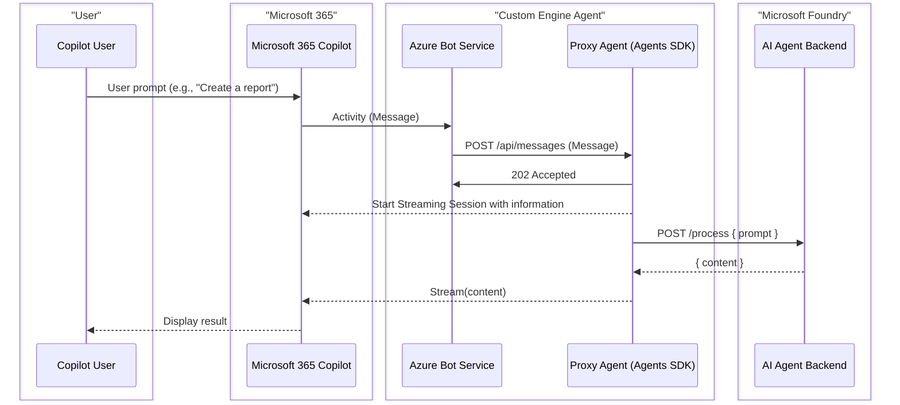
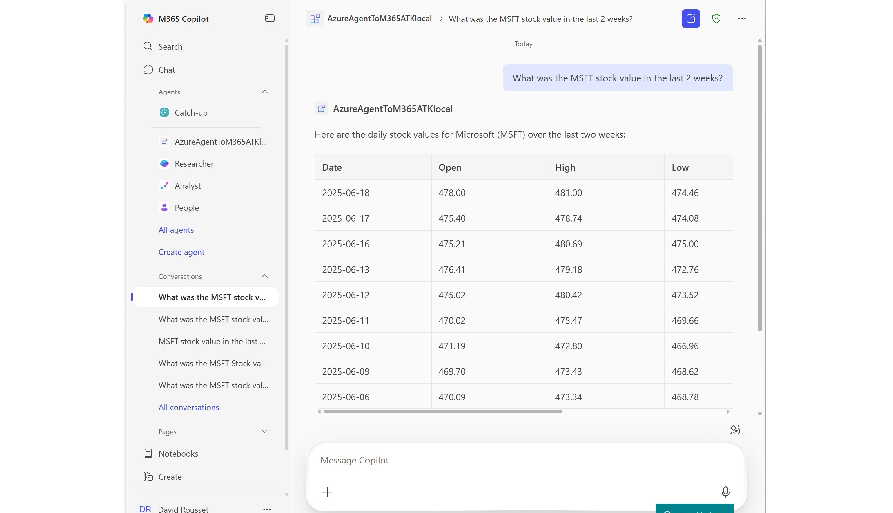

# Microsoft Foundry Agent for Microsoft 365

> **Making Microsoft Foundry Agents available in Microsoft 365 Copilot and Teams using the Microsoft 365 Agents Toolkit.**

This solution demonstrates how to integrate a Microsoft Foundry agent with Microsoft Teams and Microsoft 365 Copilot, providing a seamless experience for users to interact with powerful AI capabilities directly within their productivity tools.

[](https://www.youtube.com/watch?v=U9Yv2vjKYbI)

> **Note:** The video demonstrates the NodeJS version of this sample. This repository contains the C# implementation.

## This sample illustrates
- How to connect a Microsoft Foundry Agent to M365 Copilot
- How to use the Agent SDK with Managed Identity (no secrets in production)
- How to setup and use **SSO in M365 Copilot & Teams** and pass user tokens to Microsoft Foundry
- How to configure **SSO with Federated Credentials** for a secret-free SSO flow **(Single Tenant Only)**

---

## 🔄 Architecture Flow



This proxy pattern allows you to:
- ✅ Connect existing AI agents to Microsoft 365 Copilot
- ✅ Maintain your AI logic in Microsoft Foundry
- ✅ Provide seamless user experience in Teams and Copilot with SSO
- ✅ Handle authentication and message routing automatically

---

## 🚀 Quick Start

Choose your deployment approach:

### Local Development (Debugging)

Perfect for development and testing with breakpoints and hot reload.

> **Note:** This solution supports **VS Code only**.

1. Press **F5** in VS Code to start debugging
2. Agent is **automatically sideloaded in Teams/M365 Copilot**
3. Test directly in Teams or Copilot with full debugging support

**Full Setup Guide:** [LOCAL_DEPLOYMENT.md](LOCAL_DEPLOYMENT.md)

### Azure Production Deployment

Deploy your agent to Azure for production or dev environments.

1. Configure environment variables in `env/.env.dev`
2. Run `atk provision --env dev` to create Azure resources
3. Run `atk deploy --env dev` to deploy your bot
4. Install in Microsoft Teams

**Full Deployment Guide:** [AZURE_DEPLOYMENT.md](AZURE_DEPLOYMENT.md)

**Using Microsoft 365 Agents Toolkit in VS Code:**

1. Open the **Microsoft 365 Agents Toolkit** extension panel
2. Select **Lifecycle** section
3. Click **Provision** to create Azure resources
4. Click **Deploy** to publish your bot application

**Alternatively, using CLI:**

```powershell
atk provision --env dev
atk deploy --env dev
```

---

## 📋 Prerequisites

### Required Tools

- **Node.js 18, 20, or 22** - [Download](https://nodejs.org/)
- **Azure CLI** - [Install Guide](https://learn.microsoft.com/cli/azure/install-azure-cli)
- **Microsoft 365 Agents Toolkit CLI** - [Install Guide](https://learn.microsoft.com/en-us/microsoftteams/platform/toolkit/microsoft-365-agents-toolkit-cli#get-started)
- **Visual Studio Code** with recommended extensions (TypeScript, ESLint)

> **Important:** This solution supports **VS Code only**.

### Required Services

- **Microsoft Foundry Project** with a configured agent
- **Microsoft 365 tenant** with Teams or Copilot access
- **Azure subscription** with permission to assign Azure role-based access control (Azure RBAC).

---

## 🏗️ Solution Architecture

This solution consists of one main component:

### Bot Application + M365 Agents Toolkit Project

Node.js/TypeScript bot application that serves as a proxy between Microsoft 365 and Microsoft Foundry.

**Key Features:**

- Connects to Microsoft Foundry Agent Service
- Handles user authentication and SSO
- Manages conversation threads and message routing
- Built on Microsoft 365 Agents SDK for Node.js

### M365 Agents Toolkit Project

Infrastructure as Code and configuration for Microsoft 365 integration.

**Includes:**

- Bicep templates for Azure infrastructure deployment
- Teams app manifest configuration
- Environment configuration files
- Automated provisioning and deployment workflows

```text
ProxyAgent-NodeJS/
├── src/
│   ├── index.ts              # Application entry point (Express server)
│   ├── agent.ts              # Microsoft Foundry integration
│   ├── adapter.ts            # Bot Framework adapter configuration
│   ├── config.ts             # Configuration management
│   └── userAuthTokenWrapper.ts  # User authentication wrapper
├── appPackage/               # Teams app package
│   ├── manifest.json         # App manifest template
│   └── build/                # Generated manifests (.dev, .local, .playground)
├── env/                      # Environment configuration
│   ├── .env.dev              # Azure production environment
│   │   ├── .env.local            # Local development environment
│   │   └── .env.playground       # Playground environment
│   ├── infra/                    # Infrastructure as Code (Bicep)
│   │   ├── azure.bicep           # Production deployment template
│   │   ├── azure-local.bicep     # Local development template
│   │   └── modules/              # Reusable Bicep modules
│   ├── scripts/                  # Utility scripts
│   │   ├── devtunnel.ps1         # Dev tunnel management (PowerShell)
│   │   ├── devtunnel.sh          # Dev tunnel management (Bash)
│   │   ├── env.js                # Environment file generator
│   │   └── guid-encoder.js       # GUID encoding utility
│   ├── m365agents.yml            # Production orchestration
│   ├── m365agents.local.yml      # Local orchestration
│   ├── m365agents.playground.yml # Playground orchestration
│   ├── package.json              # Node.js dependencies
│   ├── tsconfig.json             # TypeScript configuration
│   ├── AZURE_DEPLOYMENT.md       # 📘 Azure deployment guide
│   └── LOCAL_DEPLOYMENT.md       # 📘 Local development guide
│
├── images/                       # Screenshots and diagrams
└── README.md                     # This file
```

---

## 📚 Documentation

### Deployment Guides

| Guide | Purpose | When to Use |
|-------|---------|-------------|
| **[LOCAL_DEPLOYMENT.md](LOCAL_DEPLOYMENT.md)** | Complete local development setup with debugging | Development, testing, and debugging with breakpoints |
| **[AZURE_DEPLOYMENT.md](AZURE_DEPLOYMENT.md)** | Complete Azure production deployment | Production, staging, or shared dev environments |

### Technical References

| Document | Purpose |
|----------|---------|
| **[GUID_ENCODER_GUIDE.md](infra/modules/GUID_ENCODER_GUIDE.md)** | GUID encoding for federated credentials |
| **[BOT_OAUTH_CONNECTION.md](infra/modules/BOT_OAUTH_CONNECTION.md)** | OAuth connection configuration |

---

## ⚙️ Configuration

### Microsoft Foundry Setup

1. **Create an Agent in Microsoft Foundry Portal:**
   - Configure the model (GPT-4, GPT-4 Turbo, etc.)
   - Set instructions and personality
   - Add tools and capabilities (Code Interpreter, Functions, etc.)
   Note the Agent ID (starts with `asst_...`)

2. **Get Connection Details:**
   - Project Endpoint URL
   - Agent ID
   
   

3. **Update Configuration:**
   
   Edit `env/.env.local` or `env/.env.dev`:
   
   ```env
   AZURE_AI_FOUNDRY_PROJECT_ENDPOINT=https://your-project.cognitiveservices.azure.com/
   AGENT_ID=asst_...
   ```

### Authentication for Bot Service

The bot uses **Azure Managed Identity** (production) or **Single Tenant + Client Secret** (local development) to secure Azure Bot Service connection.

**Local Development:**

```env
MicrosoftAppType=SingleTenant
MicrosoftAppId=<bot-app-id>
MicrosoftAppPassword=<client-secret>
MicrosoftAppTenantId=<tenant-id>
```

**Production - Managed Identity:**

```env
MicrosoftAppType=UserAssignedMSI
MicrosoftAppId=<managed-identity-client-id>
MicrosoftAppTenantId=<tenant-id>
```

---

## 🎯 Usage Scenarios

### In Microsoft Teams


1. Install the app in Teams (via app package upload)
2. Start a chat with the bot
3. Ask questions or give commands
4. The bot routes requests to your Microsoft Foundry agent
5. Get AI-powered responses with context awareness

### In Microsoft 365 Copilot



1. Access via https://m365copilot.com/
2. Find your agent in the left sidebar
3. Click "Open with Copilot"
4. Use natural language to interact with your Microsoft Foundry agent
5. Seamless integration with other M365 services

---

## 🔧 Development Workflow

### Local Development Cycle

1. **Install Dependencies**
   
   ```powershell
   npm install
   ```

2. **Run Bot Locally** (Press F5 in VS Code)
   - Node.js server starts with nodemon (hot reload enabled)
   - Agent is automatically sideloaded in Teams/M365 Copilot
   - Set breakpoints in your code
   - Test directly in Teams or Copilot
   - Iterate quickly without deployment

3. **Debug and Test**
   - Full end-to-end testing in real Teams/Copilot environment
   - Live debugging with breakpoints
   - Automatic restart on file changes (nodemon)

### Deployment to Azure

1. **Install Dependencies**
   
   ```powershell
   npm install
   ```

2. **Configure Environment**
   
   ```bash
   # Edit env/.env.dev
   AZURE_AI_FOUNDRY_PROJECT_ENDPOINT=https://your-project.cognitiveservices.azure.com/
   AGENT_ID=asst_...
   ```

3. **Provision and Deploy using Microsoft 365 Agents Toolkit:**
   
   **In VS Code:**
   - Open the **Microsoft 365 Agents Toolkit** extension panel
   - Under **Lifecycle**, click **Provision** to create Azure resources
   - Then click **Deploy** to publish your bot application
   
   **Or using CLI:**
   
   ```powershell
   atk provision --env dev
   atk deploy --env dev
   ```

4. **Install in Teams/Copilot**
   - Upload app package from `appPackage/build/`
   - Test in production environment

---

## 🌟 Features

### ✅ Single Sign-On (SSO)
- Seamless authentication with federated credentials
- No additional login prompts for users
- Secure token exchange

### ✅ Managed Identity (Production)
- No passwords or secrets to manage
- Automatic credential rotation
- Enhanced security posture

### ✅ Infrastructure as Code
- Repeatable deployments with Bicep
- Version-controlled infrastructure
- Easy environment replication

### ✅ Full Debugging Support
- Set breakpoints in TypeScript code in VS Code
- Hot reload with nodemon for rapid iteration
- Automatic sideloading in Teams/M365 Copilot
- Real-time testing in production environment

### ✅ Multi-Environment Support
- Separate configurations for local, dev, staging, production
- Environment-specific .env files
- Isolated deployments

### ✅ TypeScript & Modern Node.js
- Full TypeScript support for type safety
- ES modules and async/await patterns
- Express.js for web server
- Azure SDK integration (@azure/ai-agents, @azure/identity)

---

## 💰 Cost Estimates

### Local Development
- **Azure Bot Service (F0):** Free (up to 10,000 messages/month)
- **No App Service costs** (running locally)
- **Total:** ~$0/month

### Azure Production (Basic)
- **App Service Plan (B1 Linux):** ~$13/month
- **Bot Service (F0):** Free
- **Managed Identity:** Free
- **Total:** ~$13/month

### Azure Production (Standard)
- **App Service Plan (S1 Linux):** ~$70/month
- **Bot Service (S1):** ~$0.50 per 1,000 messages
- **Application Insights:** ~$2-10/month (if enabled)
- **Total:** ~$70-100/month

**See detailed cost breakdown in:** [AZURE_DEPLOYMENT.md](AZURE_DEPLOYMENT.md#cost-estimates)

---

## 🔍 Troubleshooting

### Bot Not Responding
- ✅ Check dev tunnel is running (local) or App Service is started (Azure)
- ✅ Verify bot endpoint in Azure Bot Service configuration
- ✅ Check application logs for errors
- ✅ Verify Microsoft Foundry agent is accessible

### SSO Not Working
- ✅ Check `webApplicationInfo` in app manifest
- ✅ Verify federated credentials in Entra ID app registration
- ✅ Check pre-authorized clients include Teams client IDs
- ✅ Review OAuth connection configuration

### Deployment Failures
- ✅ Verify Azure CLI login and subscription access
- ✅ Check required permissions (Contributor + Application Administrator)
- ✅ Review Bicep deployment errors in Azure Portal
- ✅ Ensure resource names are unique

**Full troubleshooting guides:**
- [Local Development Troubleshooting](LOCAL_DEPLOYMENT.md#troubleshooting)
- [Azure Deployment Troubleshooting](AZURE_DEPLOYMENT.md#troubleshooting)

---

## 📖 Additional Resources

### Microsoft 365 Agents Toolkit
- [Microsoft 365 Agents Toolkit Documentation](https://learn.microsoft.com/en-us/microsoft-365/developer/overview-m365-agents-toolkit?toc=%2Fmicrosoftteams%2Fplatform%2Ftoc.json&bc=%2Fmicrosoftteams%2Fplatform%2Fbreadcrumb%2Ftoc.json)
- [Microsoft 365 Agents Toolkit GitHub](https://github.com/OfficeDev/TeamsFx)
- [Teams App Development Guide](https://learn.microsoft.com/microsoftteams/platform/)

### Microsoft Foundry
- [Announcing Developer Essentials for Agents and Apps in Microsoft Foundry](https://devblogs.microsoft.com/foundry/announcing-developer-essentials-for-agents-and-apps-in-azure-ai-foundry/)
- [Microsoft Foundry Agent Service (General Availability)](https://techcommunity.microsoft.com/blog/azure-ai-services-blog/announcing-general-availability-of-azure-ai-foundry-agent-service/4414352)
- [Microsoft Foundry Documentation](https://learn.microsoft.com/azure/ai-services/)

### Microsoft 365 Agents SDK & Azure Bot Service
- [Microsoft 365 Agents SDK (GitHub)](https://github.com/microsoft/agents)
- [Microsoft 365 Agents SDK - Node.js Packages](https://www.npmjs.com/search?q=%40microsoft%2Fagents)
- [Azure AI Agents SDK for JavaScript](https://www.npmjs.com/package/@azure/ai-agents)
- [Azure Bot Service Documentation](https://learn.microsoft.com/azure/bot-service/)


### Tutorials & Labs
- [Build your own agent with the M365 Agents SDK and Semantic Kernel](https://microsoft.github.io/copilot-camp/pages/custom-engine/agents-sdk/)
- [Video Tutorial: Microsoft Foundry Agent in M365 Copilot](https://www.youtube.com/watch?v=U9Yv2vjKYbI)

---

## 🎓 Tutorial: Creating a Stock Agent in Microsoft Foundry

This tutorial shows you how to create the same Stock Agent demonstrated in the video and screenshots above.

### Overview

The Stock Agent retrieves historical stock market data using an external API and displays it in a conversational format. It demonstrates:
- ✅ OpenAPI tool integration
- ✅ API key authentication
- ✅ Multi-agent orchestration
- ✅ Code Interpreter for date calculations

---

### Step 1: Create the Main Stocks Agent

Create a new Agent in Microsoft Foundry Portal with the following details:

- **Name:** `Stocks Agent`
- **Deployment:** GPT-4o, GPT-4.1, or GPT-4 Turbo
- **Instructions:**
  ```
  You are an agent to search for a specific stock value using the function 'getTimeSeries'. 
  Show the data in a table except if there is a unique value returned. 
  end_date MUST be strictly superior to start_date, never send the same value for the 2 parameters.
  ```
- **Agent Description:** `Retrieve the value of a stock at a specific time`

---

### Step 2: Create API Connection for Authentication

The Stock API requires authentication via API key. We'll create a secure connection to manage this.

1. **Get an API Key:**
   - Visit [Twelve Data](https://support.twelvedata.com/en/articles/5335783-trial)
   - Register for a free API key **OR** use the demo key `demo` (limited to AAPL stock only)

2. **Create Connection in Microsoft Foundry:**
   - Go to **Management Center** → **New connection**
   - Choose **Custom keys** at the end of the selection page
   - Create key-value pair:
     - **Name:** `apikey`
     - **Value:** Your API key or `demo`
     - ✅ Check **"is secret"**
   - **Connection Name:** `StockAPI`
   - Click **Save**

---

### Step 3: Add OpenAPI Tool to the Agent

Go back to your **Stocks Agent** in the Microsoft Foundry project portal.

1. Click **Add an Action** → **OpenAPI 3.0 specified tool**

2. **Configure the tool:**
   - **Name:** `StocksAPI`
   - **Description:** `API for retrieving historical time series data for financial instruments with optional filters like start_date, end_date, and outputsize.`
   - **Authentication method:** Select **Connection** → Choose **StockAPI**

3. **Copy/paste the following OpenAPI specification:**
```json
{
  "openapi": "3.0.3",
  "info": {
    "title": "Twelve Data Time Series API",
    "description": "API for retrieving historical time series data for financial instruments with optional filters like `start_date`, `end_date`, and `outputsize`.",
    "version": "1.0.0"
  },
  "servers": [
    {
      "url": "https://api.twelvedata.com"
    }
  ],
  "paths": {
    "/time_series": {
      "get": {
        "summary": "Retrieve historical time series data",
        "description": "Retrieves historical time series data for a specified financial instrument.  The `start_date` and `end_date` parameters can be used to define boundaries for the data.  The maximum number of data points in one request is 5000.",
        "parameters": [
          {
            "name": "symbol",
            "in": "query",
            "required": true,
            "description": "The symbol of the financial instrument (e.g., AAPL for Apple Inc.).",
            "schema": {
              "type": "string"
            }
          },
          {
            "name": "interval",
            "in": "query",
            "required": true,
            "description": "The time interval between data points (e.g., 1day, 1min).",
            "schema": {
              "type": "string"
            }
          },
          {
            "name": "start_date",
            "in": "query",
            "required": false,
            "description": "The start date of the time series data in ISO format (YYYY-MM-DD).  Must be greater than `outputsize` if used alone. Must be absolutely strictly inferior to `end_date`",
            "schema": {
              "type": "string",
              "format": "date"
            }
          },
          {
            "name": "end_date",
            "in": "query",
            "required": false,
            "description": "The end date of the time series data in ISO format (YYYY-MM-DD).  Defines the upper limit of the data range. Must be absolutely strictly superior to `start_date`",
            "schema": {
              "type": "string",
              "format": "date"
            }
          },
          {
            "name": "outputsize",
            "in": "query",
            "required": false,
            "description": "The number of data points to return.  Defaults to 30 if not specified. Maximum value is 5000.",
            "schema": {
              "type": "integer"
            }
          },
          {
            "name": "apikey",
            "in": "query",
            "required": true,
            "description": "Your API key for authentication.",
            "schema": {
              "type": "string"
            }
          }
        ],
        "responses": {
          "200": {
            "description": "A successful response with the time series data.",
            "content": {
              "application/json": {
                "schema": {
                  "type": "object",
                  "properties": {
                    "meta": {
                      "type": "object",
                      "description": "Metadata about the request and time series."
                    },
                    "values": {
                      "type": "array",
                      "description": "The list of time series data points.",
                      "items": {
                        "type": "object",
                        "properties": {
                          "datetime": {
                            "type": "string",
                            "format": "date-time",
                            "description": "The timestamp of the data point."
                          },
                          "open": {
                            "type": "number",
                            "description": "The opening price."
                          },
                          "high": {
                            "type": "number",
                            "description": "The highest price."
                          },
                          "low": {
                            "type": "number",
                            "description": "The lowest price."
                          },
                          "close": {
                            "type": "number",
                            "description": "The closing price."
                          },
                          "volume": {
                            "type": "integer",
                            "description": "The traded volume."
                          }
                        }
                      }
                    }
                  }
                }
              }
            }
          },
          "400": {
            "description": "Bad request due to invalid parameters."
          },
          "401": {
            "description": "Unauthorized, invalid API key."
          },
          "500": {
            "description": "Internal server error."
          }
        },
        "operationId": "getTimeSeries"
      }
    }
  },
  "components": {
    "securitySchemes": {
      "ApiKeyAuth": {
        "type": "apiKey",
        "in": "query",
        "name": "apikey"
      }
    }
  },
  "security": [
    {
      "ApiKeyAuth": []
    }
  ]
}
```
4. Click **Next** → **Create Tool**

---

### Step 4: Test the Agent (First Attempt)

Go to the **Playground** and test your agent:

```
You: "What was the MSFT stock value in the last 2 weeks?"
```


**Problem:** The agent doesn't know today's date, so the time period is incorrect!

---

### Step 5: Create Date Helper Agent

To fix this, we'll create a helper agent that can determine the current date using Code Interpreter.

1. **Create a new Agent:**
   - **Name:** `Get Today Date`
   - **Deployment:** GPT-4o, GPT-4.1, or GPT-4 Turbo
   - **Instructions:**
     ```
     Using the code interpreter feature, please find the current today date and 
     returns its value to be used by another agent
     ```
   - **Agent Description:** `Returns the current date`

2. **Add Code Interpreter:**
   - Click **Add an Action** → **Code Interpreter**
   - Use default parameters

---

### Step 6: Connect Helper Agent to Stocks Agent

1. Go back to your **Stocks Agent**
2. Click **Add a Connect agent**
3. **Select the agent:** `Get Today Date`
4. **Unique name:** `GetTodayDate`
5. **Steps to activate the agent:**
   ```
   Use this agent when you need to know the current today's date
   ```
6. Click **Add**

---

### Step 7: Test the Complete Solution

Go back to the **Playground** and ask the same question again:

```
You: "What was the MSFT stock value in the last 2 weeks?"
```


**Success!** The agent now correctly:
1. ✅ Calls the "Get Today Date" agent to determine the current date
2. ✅ Calculates the date range (last 2 weeks)
3. ✅ Calls the Stock API with correct parameters
4. ✅ Displays results in a formatted table

---

### Debugging Agent Execution

Click **Threads logs** in the Playground to see the execution flow:


This shows you:
- Which agents were invoked
- What tools were called
- The order of execution
- Parameters passed between agents

---

### Next Steps

Now that you have a working Stock Agent, you can:
- **Integrate with this solution** by updating environment variables in `env/.env.local` or `env/.env.dev` with your agent details
- **Test in Teams** using the local deployment guide
- **Deploy to Azure** for production use
- **Extend functionality** by adding more tools or connected agents

**See:** [LOCAL_DEPLOYMENT.md](LOCAL_DEPLOYMENT.md) or [AZURE_DEPLOYMENT.md](AZURE_DEPLOYMENT.md)

---

## Known issues
- Local Debug fails to open the solution directly in the browser. You'll need to navigate to the solution manually.
- Agent Toolkit Step ExtendToM365 fails from time to time. If it happens that means that the sideloading of your packaged failed and you should do it manually with the package that was automatically provisionned for you.


## 👥 Contributors

This project was built with contributions from:

- **[@Wajeed-msft](https://github.com/Wajeed-msft)** - Project Lead & Development
- **[@ChetanSharma-msft](https://github.com/ChetanSharma-msft)** - Co-Author & Technical Contributions
- **[@ericsche](https://github.com/ericsche)** - Co-Author & Guidance, ATK Guidance & Review

Special thanks to everyone who contributed to making this solution possible!

---

## 📝 Version History

|Date| Author| Comments|
|---|---|---|
|Nov 21, 2025| ChetanSharma-msft | V1 Release built with Wajeed-msft and ericsche|
|Dec 15, 2025| ericsche | Publish on ATK Repo |

---

## 📄 License

This project is licensed under the terms specified in the [LICENSE](LICENSE) file.