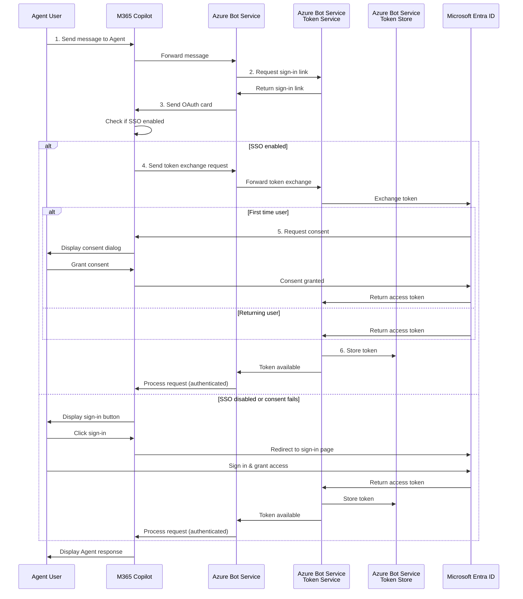

# Bot OAuth Connection Configuration

## Overview
The `bot-oauth-connection.bicep` module configures Azure AD v2 OAuth connection with federated credentials for your M365 Agent bot. This enables Single Sign-On (SSO) in Microsoft Teams.

## SSO Flow for Agents in Teams & M365 Copilot



**Key Points:**
- **Token Caching**: Azure Bot Service stores tokens for returning users
- **OAuth Card**: Agent receive an OAuth card as a mean to deliver the Authentication Request
- **SSO Experience**: First-time users see a consent dialog (unless admin consent granted before), returning users sign in silently
- **Fallback**: If SSO fails, users see traditional sign-in flow
- **Token Exchange**: Uses federated credentials for secure token exchange no client secrets to configure and manage

## Module: bot-oauth-connection.bicep

### Purpose
Creates an OAuth connection setting on the Azure Bot Service that:
- Uses Azure Active Directory v2 as the identity provider
- Leverages federated credentials (no client secret required)
- Enables SSO for seamless user authentication in Teams

### Parameters

| Parameter | Type | Required | Default | Description |
|-----------|------|----------|---------|-------------|
| `botServiceName` | string | Yes | - | Name of the Bot Service to configure |
| `connectionName` | string | No | `'SsoConnection'` | Name for the OAuth connection |
| `aadAppId` | string | Yes | - | Azure AD Application (client) ID |
| `aadAppIdUri` | string | Yes | - | Azure AD Application ID URI (e.g., `api://botid-{guid}`) |
| `scopes` | string | No | `'openid profile offline_access'` | Space-separated OAuth scopes |
| `tenantId` | string | Yes | - | Azure AD tenant ID |
| `location` | string | No | `'global'` | Resource location (always 'global' for bot connections) |
| `additionalParameters` | array | No | `[]` | Additional service provider parameters |

### Outputs

| Output | Type | Description |
|--------|------|-------------|
| `connectionName` | string | Full name of the connection (format: `botServiceName/connectionName`) |
| `connectionId` | string | Resource ID of the connection |
| `settingId` | string | Setting ID assigned by the Bot Service |
| `provisioningState` | string | Provisioning state of the connection |

### Key Features

#### Azure AD v2 Service Provider
- **Service Provider ID**: `30dd229c-58e3-4a48-bdfd-91ec48eb906c`
- **Provider**: Azure Active Directory v2
- **Authentication**: OAuth 2.0 with OpenID Connect

#### Federated Credentials
- **No Client Secret Required**: Uses federated identity credentials created in the app registration
- **Secure**: Token exchange happens through Azure AD without storing secrets
- **Modern**: Leverages managed identity and federated credentials

#### Default Scopes
- `openid`: OpenID Connect authentication
- `profile`: User profile information
- `offline_access`: Refresh token support

#### Token Exchange
- Configured with `tokenExchangeUrl` pointing to the app ID URI
- Enables seamless SSO in Teams without additional user prompts

## Integration in azure.bicep

The OAuth connection is deployed as **Step 5** in the orchestration:

```bicep
// Step 5: Configure OAuth Connection with Azure AD v2 and Federated Credentials
module botOAuthConnection 'modules/bot-oauth-connection.bicep' = {
  name: 'deploy-bot-oauth-connection'
  params: {
    botServiceName: botServiceName
    connectionName: 'SsoConnection'
    aadAppId: appRegistration.outputs.aadAppId
    aadAppIdUri: appRegistration.outputs.aadAppIdUri
    scopes: 'openid profile offline_access'
    tenantId: tenantId
    location: 'global'
  }
}
```

### Dependencies
- **Requires**: App Registration module must complete first (provides `aadAppId` and `aadAppIdUri`)
- **Uses**: Bot Service created in Step 3
- **Implicit Dependency**: Bicep automatically handles dependency through output references

## Deployment Flow

1. **Managed Identity Created** → Bot identity established
2. **App Service Deployed** → Web app with managed identity
3. **Bot Service Created** → Bot registered with Teams channel
4. **App Registration Created** → Entra ID app with federated credentials
5. **OAuth Connection Configured** → SSO enabled with AAD v2 ✨

## Usage in Bot Code

Once deployed, your bot can use this connection for SSO:

```typescript
// Reference the connection name in your bot
const connectionName = "SsoConnection"; // Must match the connectionName parameter

// Use in Microsoft 365 Agents SDK (Node.js)
import { UserTokenClient } from "@microsoft/agents-hosting";

const userTokenClient = new UserTokenClient(process.env.MicrosoftAppId || "");

// Get user token for Microsoft Foundry access
const tokenResponse = await userTokenClient.getUserToken(
  context,
  connectionName,
  undefined // magicCode
);

if (tokenResponse?.token) {
  // Use token to authenticate with Microsoft Foundry
  const userToken = tokenResponse.token;
  // Pass to Microsoft Foundry client for user-authenticated requests
}
```

## Customization

### Additional Scopes
To request additional Microsoft Graph permissions:

```bicep
scopes: 'openid profile offline_access User.Read Mail.Read'
```

### Custom Parameters
Add service provider-specific parameters:

```bicep
additionalParameters: [
  {
    key: 'customParam'
    value: 'customValue'
  }
]
```

## Verification

After deployment, verify the connection:

1. **Azure Portal**:
   - Navigate to Bot Service → Settings → OAuth Connection Settings
   - Verify "SsoConnection" appears with status "Success"

2. **Test Connection**:
   - Click "Test Connection" in Azure Portal
   - Sign in with a test user
   - Verify successful authentication

3. **Bot Code**:
   - Test SSO flow in Teams
   - Verify token acquisition succeeds

## Troubleshooting

### Connection Not Visible
- Ensure app registration completed successfully
- Verify federated credential was created
- Check bot service name matches

### Token Exchange Fails
- Verify `aadAppIdUri` matches app registration (`api://botid-{guid}`)
- Ensure federated credential subject is correct
- Check tenant ID matches

### SSO Prompt Still Appears
- Verify pre-authorized applications in app registration
- Check scopes are correctly configured
- Ensure Teams app manifest uses correct app ID

## Security Notes

✅ **No Client Secrets**: Uses federated credentials for enhanced security  
✅ **Managed Identity**: Bot uses managed identity for Azure resources  
✅ **Token Exchange**: Secure token exchange through AAD  
✅ **Scoped Permissions**: Only requests necessary scopes  

## Next Steps

After OAuth connection is configured:
1. Update Teams app manifest with correct app IDs
2. Configure bot code to use the connection
3. Test SSO flow in Teams/M365 Copilot chat
4. Add additional Graph API permissions as needed (optional)

## Resources

- [Azure Bot Service OAuth Documentation](https://docs.microsoft.com/azure/bot-service/bot-builder-authentication)
- [Azure AD v2 Token Exchange](https://docs.microsoft.com/azure/bot-service/bot-builder-authentication-sso)
- [Teams SSO for Bots](https://docs.microsoft.com/microsoftteams/platform/bots/how-to/authentication/auth-aad-sso-bots)
