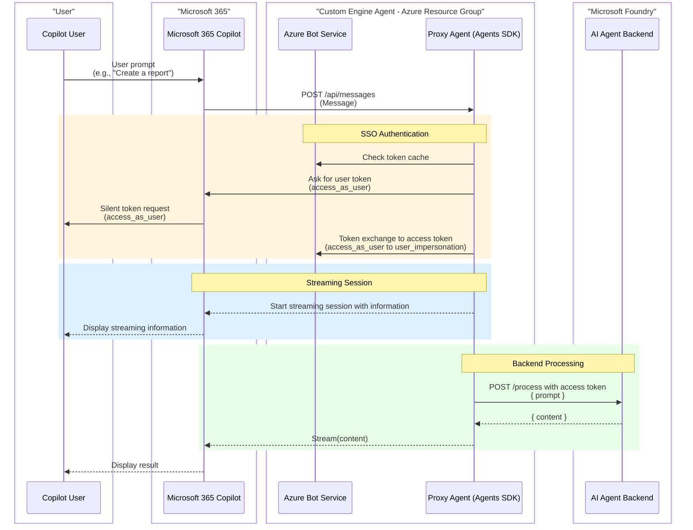

# Microsoft Foundry Agent for Microsoft 365 (Python)

> **Making Microsoft Foundry Agents available in Microsoft 365 Copilot and Teams using the Microsoft 365 Agents Toolkit.**

This solution demonstrates how to integrate a Microsoft Foundry agent with Microsoft Teams and Microsoft 365 Copilot using **Python**, providing a seamless experience for users to interact with powerful AI capabilities directly within their productivity tools.

[](https://www.youtube.com/watch?v=U9Yv2vjKYbI)

## This sample illustrates
- How to connect an Azure AI Foundry Agent to M365 Copilot
- How to use the Agent SDK with Managed Identity (no secrets in production)
- How to setup and use **SSO in M365 Copilot & Teams** and pass user tokens to Azure AI Foundry
- How to configure **SSO with Federated Credentials** for a secret-free SSO flow **(Single Tenant Only)**

---

## 🔄 Architecture Flow

This is an high level sequence diagram illustrating the interaction flow between the user, Microsoft 365 Copilot, the Proxy Agent, and the Microsoft Foundry AI agent.



This proxy pattern allows you to:
- ✅ Connect existing AI agents to Microsoft 365 Copilot
- ✅ Maintain your AI logic in Microsoft Foundry
- ✅ Provide seamless user experience in Teams and Copilot with SSO
- ✅ Handle authentication and message routing automatically

---
## 🚀 Quick Start

Choose your deployment approach:

### Local Development (Debugging)

Perfect for development and testing with breakpoints and hot reload.

> **Note:** This solution supports **VS Code only**.

**See:** [LOCAL_DEPLOYMENT.md](LOCAL_DEPLOYMENT.md)

**One-time setup (before first F5):**
```powershell
# Create and activate virtual environment
python -m venv .venv
.venv\Scripts\Activate.ps1  # Windows
# source .venv/bin/activate  # Linux/Mac

# Install dependencies
pip install -r src/requirements.txt
```

**Then press F5:**
```powershell
# Press F5 in VS Code
# Agent is automatically sideloaded in Teams/M365 Copilot for testing
```

### Azure Production Deployment

Deploy your agent to Azure for production or dev environments.

**See:** [AZURE_DEPLOYMENT.md](AZURE_DEPLOYMENT.md)

**Using Microsoft 365 Agents Toolkit in VS Code:**

1. Open the **Microsoft 365 Agents Toolkit** extension panel
2. Select **Lifecycle** section
3. Click **Provision** to create Azure resources
4. Click **Deploy** to publish your bot application

**Alternatively, using CLI:**

```powershell
atk provision --env dev
atk deploy --env dev
```

---

## 📋 Prerequisites

### Required Tools

- **Python 3.12** - [Download](https://www.python.org/)
- **Azure CLI** - [Install Guide](https://learn.microsoft.com/cli/azure/install-azure-cli)
- **Microsoft 365 Agents Toolkit CLI** - [Install Guide](https://learn.microsoft.com/en-us/microsoftteams/platform/toolkit/microsoft-365-agents-toolkit-cli#get-started)
- **Visual Studio Code** with Python extension

> **Important:** This solution currently supports **VS Code only**. Visual Studio support is planned for future releases.

### Required Services

- **Azure AI Foundry Project** with a configured agent
- **Microsoft 365 tenant** with Teams or Copilot access
- **Azure subscription** with permission to assign Azure role-based access control (Azure RBAC).

---

## 🏗️ Solution Architecture

This solution consists of one main component:

### Bot Application + M365 Agents Toolkit Project(`ProxyAgent-Python/`)

Python bot application that serves as a proxy between Microsoft 365 and Azure AI Foundry.

**Key Features:**

- Connects to Azure AI Foundry Agent Service using **azure-ai-projects** SDK
- Handles user authentication and SSO
- Manages conversation threads and message routing
- Built on Microsoft 365 Agents SDK for Python

### M365 Agents Toolkit Project

Infrastructure as Code and configuration for Microsoft 365 integration.

**Includes:**

- Bicep templates for Azure infrastructure deployment
- Teams app manifest configuration
- Environment configuration files
- Automated provisioning and deployment workflows

```text
ProxyAgent-Python/
├── src/
│   ├── main.py               # Application entry point (aiohttp server)
│   ├── agent.py              # Azure AI Foundry integration
│   ├── start_server.py       # Server configuration
│   └── requirements.txt      # Python dependencies
├── appPackage/               # Teams app package
│   ├── manifest.json         # App manifest template
│   └── build/                # Generated manifests (.dev, .local)
├── env/                      # Environment configuration
│   ├── .env.dev              # Azure production environment
│   └── .env.local            # Local development environment
├── infra/                    # Infrastructure as Code (Bicep)
│   ├── azure.bicep           # Production deployment template
│   ├── azure-local.bicep     # Local development template
│   └── modules/              # Reusable Bicep modules
├── scripts/                  # Utility scripts
│   ├── devtunnel.ps1         # Dev tunnel management (PowerShell)
│   ├── devtunnel.sh          # Dev tunnel management (Bash)
│   ├── env.js                # Environment file generator
│   └── guid-encoder.js       # GUID encoding utility
├── m365agents.yml            # Production orchestration
├── m365agents.local.yml      # Local orchestration
├── AZURE_DEPLOYMENT.md       # 📘 Azure deployment guide
├── LOCAL_DEPLOYMENT.md       # 📘 Local development guide
└── README.md                 # This file
```

---

## 📚 Documentation

### Deployment Guides

| Guide | Purpose | When to Use |
|-------|---------|-------------|
| **[LOCAL_DEPLOYMENT.md](LOCAL_DEPLOYMENT.md)** | Complete local development setup with debugging | Development, testing, and debugging with breakpoints |
| **[AZURE_DEPLOYMENT.md](AZURE_DEPLOYMENT.md)** | Complete Azure production deployment | Production, staging, or shared dev environments |

### Technical References

| Document | Purpose |
|----------|---------|
| **[GUID_ENCODER_GUIDE.md](infra/modules/GUID_ENCODER_GUIDE.md)** | GUID encoding for federated credentials |
| **[BOT_OAUTH_CONNECTION.md](infra/modules/BOT_OAUTH_CONNECTION.md)** | OAuth connection configuration |

---

## ⚙️ Configuration

### Microsoft Foundry Setup

1. **Create an Agent in Microsoft Foundry Portal:**
   - Configure the model (GPT-4, GPT-4 Turbo, etc.)
   - Set instructions and personality
   - Add tools and capabilities (Code Interpreter, Functions, etc.)
   - Note the Agent ID (starts with `asst_...`)

2. **Get Connection Details:**
   - Project Endpoint URL
   - Agent ID
   
3. **Update Configuration:**
   
   Edit `env/.env.local` or `env/.env.dev`:
   
   ```env
   AZURE_AI_FOUNDRY_PROJECT_ENDPOINT=https://your-project.cognitiveservices.azure.com/
   AGENT_ID=asst_...
   ```

### Authentication for Bot Service

The bot uses **Azure Managed Identity** (production) or **Single Tenant + Client Secret** (local development) to secure Azure Bot Service connection.

**Local Development (.env.local):**

```env
MicrosoftAppType=SingleTenant
MicrosoftAppId=<bot-app-id>
MicrosoftAppPassword=<client-secret>
MicrosoftAppTenantId=<tenant-id>
```

**Production - Managed Identity (.env.dev):**

```env
MicrosoftAppType=UserAssignedMSI
MicrosoftAppId=<managed-identity-client-id>
MicrosoftAppTenantId=<tenant-id>
```

---

## 🎯 Usage Scenarios

### In Microsoft Teams

1. Install the app in Teams (via app package upload)
2. Start a chat with the bot
3. Ask questions or give commands
4. The bot routes requests to your Microsoft Foundry agent
5. Get AI-powered responses with context awareness

### In Microsoft 365 Copilot

1. Access via https://m365copilot.com/
2. Find your agent in the left sidebar
3. Click "Open with Copilot"
4. Use natural language to interact with your Microsoft Foundry agent
5. Seamless integration with other M365 services

---

## 🔧 Development Workflow

### Local Development Cycle

1. **Create Python Environment**
   
   ```powershell
   python -m venv .venv
   .venv\Scripts\Activate.ps1
   pip install -r src/requirements.txt
   ```

2. **Run Bot Locally** (Press F5 in VS Code)
   - Python server starts with aiohttp
   - Agent is automatically sideloaded in Teams/M365 Copilot
   - Set breakpoints in Python files
   - Test directly in Teams or Copilot
   - Iterate quickly without deployment

2. **Debug and Test**
   - Full end-to-end testing in real Teams/Copilot environment
   - Live debugging with breakpoints in Python

### Deployment to Azure

1. **Configure Environment**
   
   ```bash
   # Edit env/.env.dev
   AZURE_SUBSCRIPTION_ID=<your-subscription-id>
   RESOURCE_SUFFIX=prod123
   AZURE_AI_FOUNDRY_PROJECT_ENDPOINT=https://your-project.cognitiveservices.azure.com/
   AGENT_ID=asst_...
   ```

2. **Provision and Deploy using Microsoft 365 Agents Toolkit:**
   
   **In VS Code:**
   - Open the **Microsoft 365 Agents Toolkit** extension panel
   - Under **Lifecycle**, click **Provision** to create Azure resources
   - Then click **Deploy** to publish your bot application
   
   **Or using CLI:**
   
   ```powershell
   atk provision --env dev
   atk deploy --env dev
   ```

3. **Install in Teams/Copilot**
   - Upload app package from `appPackage/build/`
   - Test in production environment

---

## 🌟 Features

### ✅ Single Sign-On (SSO)
- Seamless authentication with federated credentials
- No additional login prompts for users
- Secure token exchange

### ✅ Managed Identity (Production)
- No passwords or secrets to manage
- Automatic credential rotation
- Enhanced security posture

### ✅ Infrastructure as Code
- Repeatable deployments with Bicep
- Version-controlled infrastructure
- Easy environment replication

### ✅ Full Debugging Support
- Set breakpoints in Python code in VS Code
- Automatic sideloading in Teams/M365 Copilot
- Real-time testing in production environment

### ✅ Multi-Environment Support
- Separate configurations for local, dev, staging, production
- Environment-specific .env files
- Isolated deployments

### ✅ Modern Python
- Python 3.12 support
- Async/await patterns with aiohttp
- Azure SDK integration (azure-ai-projects, azure-identity)

---

## 💰 Cost Estimates

### Local Development
- **Azure Bot Service (F0):** Free (up to 10,000 messages/month)
- **No App Service costs** (running locally)
- **Total:** ~$0/month

### Azure Production (Basic)
- **App Service Plan (B1 Linux):** ~$13/month
- **Bot Service (F0):** Free
- **Managed Identity:** Free
- **Total:** ~$13/month

### Azure Production (Standard)
- **App Service Plan (S1 Linux):** ~$70/month
- **Bot Service (S1):** ~$0.50 per 1,000 messages
- **Application Insights:** ~$2-10/month (if enabled)
- **Total:** ~$70-100/month

**See detailed cost breakdown in:** [AZURE_DEPLOYMENT.md](AZURE_DEPLOYMENT.md#cost-estimates)

---

## 🔍 Troubleshooting

### Bot Not Responding
- ✅ Check dev tunnel is running (local) or App Service is started (Azure)
- ✅ Verify bot endpoint in Azure Bot Service configuration
- ✅ Check application logs for errors
- ✅ Verify Microsoft Foundry agent is accessible

### SSO Not Working
- ✅ Check `webApplicationInfo` in app manifest
- ✅ Verify federated credentials in Entra ID app registration
- ✅ Check pre-authorized clients include Teams client IDs
- ✅ Review OAuth connection configuration

### Deployment Failures
- ✅ Verify Azure CLI login and subscription access
- ✅ Check required permissions (Contributor + Application Administrator)
- ✅ Review Bicep deployment errors in Azure Portal
- ✅ Ensure resource names are unique

**Full troubleshooting guides:**
- [Local Development Troubleshooting](LOCAL_DEPLOYMENT.md#troubleshooting)
- [Azure Deployment Troubleshooting](AZURE_DEPLOYMENT.md#troubleshooting)

---

## 📖 Additional Resources

### Microsoft 365 Agents Toolkit
- [Microsoft 365 Agents Toolkit Documentation](https://learn.microsoft.com/en-us/microsoft-365/developer/overview-m365-agents-toolkit?toc=%2Fmicrosoftteams%2Fplatform%2Ftoc.json&bc=%2Fmicrosoftteams%2Fplatform%2Fbreadcrumb%2Ftoc.json)
- [Microsoft 365 Agents Toolkit GitHub](https://github.com/OfficeDev/TeamsFx)
- [Teams App Development Guide](https://learn.microsoft.com/microsoftteams/platform/)

### Microsoft Foundry
- [Announcing Developer Essentials for Agents and Apps in Microsoft Foundry](https://devblogs.microsoft.com/foundry/announcing-developer-essentials-for-agents-and-apps-in-azure-ai-foundry/)
- [Microsoft Foundry Agent Service (General Availability)](https://techcommunity.microsoft.com/blog/azure-ai-services-blog/announcing-general-availability-of-azure-ai-foundry-agent-service/4414352)
- [Microsoft Foundry Documentation](https://learn.microsoft.com/azure/ai-services/)

### Microsoft 365 Agents SDK & Azure Bot Service
- [Microsoft 365 Agents SDK (GitHub)](https://github.com/microsoft/agents)
- [Microsoft 365 Agents SDK - Python Packages](https://pypi.org/search/?q=microsoft-agents)
- [Azure AI Projects SDK for Python](https://pypi.org/project/azure-ai-projects/)
- [Azure Bot Service Documentation](https://learn.microsoft.com/azure/bot-service/)

### Tutorials & Labs
- [Build your own agent with the M365 Agents SDK and Semantic Kernel](https://microsoft.github.io/copilot-camp/pages/custom-engine/agents-sdk/)
- [Video Tutorial: Microsoft Foundry Agent in M365 Copilot](https://www.youtube.com/watch?v=U9Yv2vjKYbI)

---

## Known issues
- Local Debug fails to open the solution directly in the browser. You'll need to navigate to the solution manually.
- Agent Toolkit Step ExtendToM365 fails from time to time. If it happens that means that the sideloading of your packaged failed and you should do it manually with the package that was automatically provisionned for you.

---

## 👥 Contributors

This project was built with contributions from:

- **[@Wajeed-msft](https://github.com/Wajeed-msft)** - Project Lead & Development
- **[@AjayJ12-msft](https://github.com/AjayJ12-MSFT)** - Co-Author & Technical Contributions
- **[@ericsche](https://github.com/ericsche)** - Co-Author & Guidance
- **[@ericsche](https://github.com/ericsche)** - ATK Guidance & Review

Special thanks to everyone who contributed to making this solution possible!

---

## 📝 Version History

|Date| Author| Comments|
|---|---|---|
|Nov 25, 2025| AjayJ12-MSFT | V1 Release built with Wajeed-msft and ericsche |

---

## 📄 License

This project is licensed under the terms specified in the [LICENSE](LICENSE) file.
