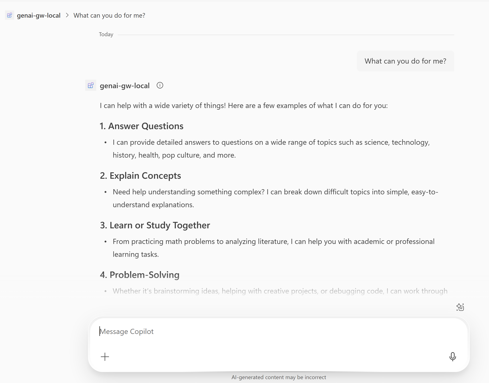

# Overview of the Custom Engine Agent using APIM GenAI Gateway

This sample demonstrates how to build a **[Custom Engine Agent](https://learn.microsoft.com/en-us/microsoft-365-copilot/extensibility/overview-custom-engine-agent)** that leverages **[Azure API Management (APIM) GenAI Gateway](https://learn.microsoft.com/en-us/azure/api-management/genai-gateway-capabilities)** capabilities to provide a robust, enterprise-ready AI assistant experience in Microsoft Teams.

## Architecture Overview

This sample deploys a complete AI gateway infrastructure including:

### Core AI Infrastructure
- **2x Azure OpenAI Services** with load balancing for high availability
- **GPT-4o models** for conversational AI and text generation
- **Text-embedding-ada-002 models** for semantic search and similarity

### APIM GenAI Gateway Features
- **Backend Pool Load Balancer** distributing traffic across AI services
- **Token Limit Policies** enforcing usage quotas per user/application
- **Emit Token Metrics** for detailed cost tracking and analytics
- **Semantic Cache** reducing redundant API calls for similar queries
- **Content Safety Policies** filtering inappropriate content
- **Circuit Breaker Pattern** ensuring resilience during service outages

### Supporting Services
- **Azure Cache for Redis** powering the semantic cache functionality
- **Azure Monitor & Application Insights** for comprehensive observability
- **Content Safety Service** (optional) for additional content moderation

### Custom Engine Agent
- The Custom Engine Agent is built using the Mcicrosoft Agents SDK and operates as a collaborative bot within Microsoft 365 Copilot. It connects through the APIM gateway to access AI services, benefiting from enterprise-grade load balancing, caching, monitoring, and security features while maintaining the flexibility to implement custom orchestration and AI workflows.

## Benefits of This Architecture

1. **Scalability**: Handle thousands of concurrent users with load balancing
2. **Reliability**: Built-in failover and circuit breaker patterns
3. **Cost Control**: Intelligent caching and usage monitoring reduce token consumption
4. **Security**: Centralized authentication and content filtering
5. **Observability**: Comprehensive metrics and logging for production monitoring
6. **Flexibility**: Easy to add new AI models or modify routing policies


## Get started with the sample

> **Prerequisites**
>
> To run the sample in your local dev machine, you will need:
>
- [Node.js](https://nodejs.org/), supported versions: 18, 20, 22. 
- [Microsoft 365 Agents Toolkit Visual Studio Code Extension](https://aka.ms/teams-toolkit) latest version or [Microsoft 365 Agents Toolkit CLI](https://aka.ms/teams-toolkit-cli).
- An Azure account and a subscription, **which you need to make sure your subscription has quota to create cognitive service in the location you selected.**
- [Azure CLI](https://docs.microsoft.com/en-us/cli/azure/install-azure-cli) installed and configured with access to your Azure subscription.
- A [Microsoft 365 account for development](https://docs.microsoft.com/microsoftteams/platform/toolkit/accounts).

### Cost Estimation

Before deploying, estimate your costs using our pricing script:

```powershell
# Run with default configuration (Basic APIM, S0 AI Services, 137 tokens/hour)
.\scripts\estimate-pricing.ps1

# Run cost estimation with your custom configuration
.\scripts\estimate-pricing.ps1 -ApimSku "Developer" -AiServicesSku "S0" -EstimatedHourlyTokens 137
```

**Parameters you can customize:**
- `-ApimSku`: Developer, Basic, Standard, Premium
- `-AiServicesSku`: F0 (Free), S0 (Standard) 
- `-ContentSafetySku`: F0 (Free), S0 (Standard)
- `-EstimatedHourlyTokens`: Your expected hourly token usage
- `-Location`: Azure region (e.g., "East US", "West US 2")

**Example output:**
```
Total Cost Summary
-----------------------------------------
  Base Infrastructure Cost: $0.1137/hour
  Estimated Usage Cost: $0.0012/hour
  TOTAL ESTIMATED COST: $0.1149/hour

  Daily equivalent (24 hours): $2.76/day
```

> Use the [Azure Pricing Calculator](https://azure.microsoft.com/en-us/pricing/calculator/) for official pricing in your region.

### Configuration for deployment
1. In [main.parameters.json](./infra/apim-new-ai-service/main.parameters.json), you can choose your preferred pricing tier of APIM service, AI services, contentSafety service by setting `apimSku`, `aiServicesSku` and `contentSafetySku`.

2. In [main.parameters.json](./infra/apim-new-ai-service/main.parameters.json), you can set value of `enableContentSafety` to **false** to disable [content safety check](https://learn.microsoft.com/en-us/azure/ai-services/content-safety/overview).

    ```
    "parameters": {
        "resourceBaseName": {
            "value": "bot${{RESOURCE_SUFFIX}}"
        },
        "apimSku": {
            "value": "Developer" 
        },
        "aiServicesSku": {
            "value": "S0"
        },
        "contentSafetySku": {
            "value": "S0"
        },
        "enableContentSafety": {
            "value": true
        }
    }
    ```

### Post-Deployment Configuration

**You need an API key after deployment.** Specifically, you need the **APIM subscription key** to connect your application to the API Management service.

By default, **Microsoft 365 Agents Toolkit** handles this automatically when you run:
- `teamsapp provision` 
- `teamsapp deploy`
- VS Code F5 debugging

The toolkit will automatically retrieve the APIM subscription key and store it in your environment file.

<details>
<summary><strong>Manual Key Retrieval</strong> (click to expand if needed)</summary>

If you deployed the infrastructure manually or need to retrieve the key separately:

**Option 1: Azure Portal Method**
1. Navigate to [Azure Portal](https://portal.azure.com)
2. Go to your **API Management service** (name format: `apim-{yourbasename}`)
3. In the left menu, select **Subscriptions** under **APIs**
4. Find the subscription named **"aiservices-subscription"**
5. Click **"Show/hide keys"** and copy the **Primary key**
6. Add the key to your appropriate environment file in the format: `SECRET_AZURE_OPENAI_API_KEY=<your-primary-key-value>`

**Option 2: Azure CLI Direct Command**
```bash
# Replace with your actual values
az rest --method post \
  --url "https://management.azure.com/subscriptions/{subscription-id}/resourceGroups/{resource-group}/providers/Microsoft.ApiManagement/service/{apim-service-name}/subscriptions/aiservices-subscription/listSecrets?api-version=2021-08-01" \
  --query primaryKey -o tsv
```
**Note:** Store the returned key value in your environment file as: `SECRET_AZURE_OPENAI_API_KEY=<returned-key-value>`

**Environment File Locations:**
- **Local development**: `env/.env.local.user`  
- **Playground environment**: `env/.env.playground.user`
- **Production environment**: `env/.env.{environment}.user`

</details>

> 🔒 **Security Note**: For security reasons, API keys are not exposed in Bicep template outputs. This ensures sensitive credentials are not stored in deployment logs or visible in the Azure Portal deployment history.


### Conversation with Agent
1. Select the Microsoft 365 Agents Toolkit icon on the left in the VS Code toolbar.
1. In the Account section, sign in with your [Microsoft 365 account](https://docs.microsoft.com/microsoftteams/platform/toolkit/accounts) if you haven't already.
1. Press F5 to start debugging which launches your app in Teams using a web browser. Select `Debug in Copilot (Edge)` or `Debug in Copilot (Chrome)`.
1. When Copilot launches in the browser, select the Add button in the dialog to install your app to Copilot.
1. You will receive a welcome message from the agent, or send any message to get a response.

**Congratulations**! You are running an application that can now interact with users in Copilot:


> For local debugging using Microsoft 365 Agents Toolkit CLI, you need to do some extra steps described in [Set up your Microsoft 365 Agents Toolkit CLI for local debugging](https://aka.ms/teamsfx-cli-debugging).
