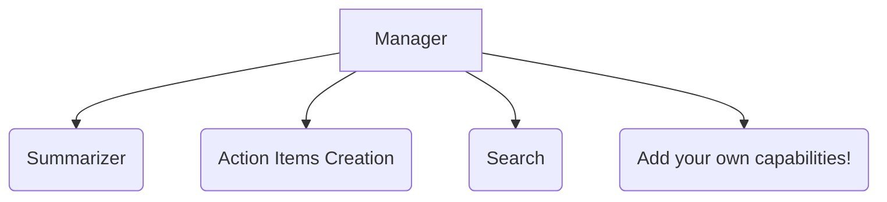
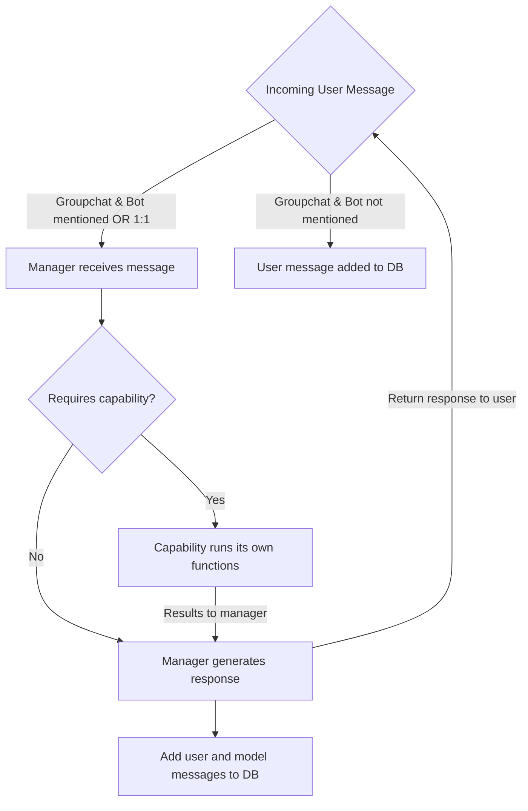

# Getting Started with Collaborator Agent

This intelligent collaboration assistant is built with the [Teams AI Library v2](https://aka.ms/teamsai-v2), and showcases how to create a sophisticated bot that can analyze conversations, manage tasks, and search through chat history using advanced AI capabilities and natural language processing.

The Collaborator Agent enhances team productivity by providing intelligent conversation analysis, automatic task management, and powerful search capabilities. It can listen to all messages in a group chat (even without being @mentioned) using RSC (Resource Specific Control) permissions, making it a seamless addition to any team workflow.

**[Watch the Collaborator Agent Demo](https://www.youtube.com/watch?v=RuIfcNcBB_8)**

## This sample illustrates
- Use Microsoft 365 Agents Toolkit to create an AI-powered collaboration assistant
- Implement RSC (Resource Specific Control) permissions for group chat monitoring
- Use Teams AI Library v2 for advanced conversation analysis and task management
- Build multi-capability architecture with specialized AI functions
- Create natural language search and time-based query processing
- Implement SQLite database integration for conversation history storage

## Key Features

- 📋 **Intelligent Summarization** - Analyze conversations and provide structured summaries with proper participant attribution and topic identification
- ✅ **Action Items** - Automatically identify and create action items from team discussions with smart assignment
- 🔍 **Conversation Search** - Search through chat history using natural language queries with time-based filtering and deep linking to original messages

## Adding Custom Capabilities

Adding your own capabilities only requires a few steps:

1. Copy the template folder under capabilities [template](src\capabilities\template\template.ts)
2. Customize your capability to do what you want (helpful to look at existing capabilities)
3. Make sure to create a CapabilityDefinition at the bottom of your main file
4. Register your capability by importing the CapabilityDefinition and adding to the definition list in [registry](src\capabilities\registry.ts)
5. The manager will automatically be instantiated with the capability you defined!

## Agent Architecture



## Flow of the Agent



If Collab Agent is added to a groupchat or private message, it will always listen and log each message to its database. The messages are stored in an SQLite DB by the conversation ID of the given conversation. 
The agent will respond whenever @mentioned in groupchats and will always respond in 1-on-1 messages. When the agent responds, the request is first passed through a manger prompt.
This manager may route to a capability based on the request--this capability returns its result back to the manager where it will be passed back to the user.


## Prerequisite to use this sample
- [Node.js](https://nodejs.org/) version 18.x or higher
- A Microsoft 365 tenant in which you have permission to upload Teams apps. You can get a free Microsoft 365 developer tenant by joining the [Microsoft 365 developer program](https://developer.microsoft.com/en-us/microsoft-365/dev-program).
- [Microsoft 365 Agents Toolkit for VS Code](https://aka.ms/teams-toolkit) or [Microsoft 365 Agents Toolkit CLI](https://aka.ms/teams-toolkit-cli)
- Azure OpenAI resource with GPT-4 deployment

## Minimal path to awesome

### Run the app locally

1. Install dependencies:
    ```bash
    npm install
    ```

2. Configure environment variables:
    - Open the project in Visual Studio Code
    - The Microsoft 365 Agents Toolkit will automatically generate the required environment files
    - Update the `.localConfigs` file (or `.localConfigs.playground` if debug with playground) with your Azure OpenAI configuration:
      - `SECRET_AZURE_OPENAI_API_KEY`: Your Azure OpenAI API key
      - `AZURE_OPENAI_ENDPOINT`: Your Azure OpenAI endpoint URL
      - `AZURE_OPENAI_DEPLOYMENT_NAME`: Your GPT-4 model deployment name

3. Open the project in Visual Studio Code
4. Press F5 to start the debug session (Debug Edge)
5. Microsoft 365 Agents Toolkit will handle:
    - Starting the local bot server
    - Tunneling for external access
    - Opening Teams with your bot loaded
6. @mention the bot in any conversation to start using its capabilities!

### Deploy the app to Azure
1. Open the project in Visual Studio Code
2. Use Microsoft 365 Agents Toolkit to provision and deploy to Azure
3. Follow the deployment prompts to configure your Azure resources

### Preview the app in Teams
1. Launch remote debugging or use the deployed version
2. Install the app in Microsoft Teams
3. @mention the bot in conversations to activate its capabilities

## Sample Questions

You can ask the Collaborator agent questions like:

**Summarization:**
- "@Collaborator summarize yesterday's discussion"
- "@Collaborator what were the main topics from last week?"
- "@Collaborator give me an overview of recent messages"

**Action Items:**
- "@Collaborator find action items from the past 3 days"
- "@Collaborator create a task to review the proposal by Friday"
- "@Collaborator what tasks are assigned to me?"

**Search:**
- "@Collaborator find messages about the project deadline"
- "@Collaborator search for conversations between Alice and Bob"
- "@Collaborator locate discussions from this morning about the budget"

## Advanced usage of this sample

### Adding Custom Capabilities

Adding your own capabilities only requires a few steps:

1. Copy the template folder under capabilities [template](src\capabilities\template\template.ts)
2. Customize your capability to do what you want (helpful to look at existing capabilities)
3. Make sure to create a CapabilityDefinition at the bottom of your main file
4. Register your capability by importing the CapabilityDefinition and adding to the definition list in [registry](src\capabilities\registry.ts)
5. The manager will automatically be instantiated with the capability you defined!

### Agent Architecture


### Flow of the Agent


If Collab Agent is added to a groupchat or private message, it will always listen and log each message to its database. The messages are stored in an SQLite DB by the conversation ID of the given conversation. 
The agent will respond whenever @mentioned in groupchats and will always respond in 1-on-1 messages. When the agent responds, the request is first passed through a manger prompt.
This manager may route to a capability based on the request--this capability returns its result back to the manager where it will be passed back to the user.

## Version History

| Date         | Author     | Comments                               |
| ------------ | ---------- | -------------------------------------- |
| Oct 31, 2025  | qinzhouxu   | Onboard sample with Teams AI Library V2 |

## Feedback
We really appreciate your feedback! If you encounter any issue or error, please report issues to us following the [Supporting Guide](https://github.com/OfficeDev/TeamsFx-Samples/blob/dev/SUPPORT.md). Meanwhile you can make [recording](https://aka.ms/teamsfx-record) of your journey with our product, they really make the product better. Thank you!
